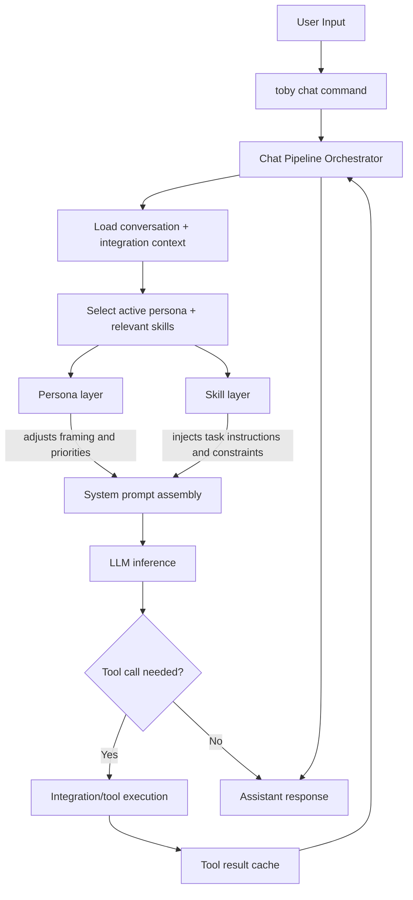

Toby is an assistant that experiments with the application of personas on top of the standard skill-based architecture.

Personas can mutate skills and bare prompts in interesting ways.  A concrete example would be a persona of a technologist
who is defined as a person who is most interested in the technical aspects of the subject matter which is being discussed
and probed with the AI.  A skill which describes how to organize emails would pair with the technologist in that the 
technologist would prioritize emails related to technical subject matter before other subjects.

This is in contrast to a persona of a project manager who is more focused on the organization of schedules and the 
communications between disparate teams.  Those same emails would be prioritized differently for the project manager
persona.

Toby combines:

- Integration-aware commands (for services like Gmail, Todoist, Slack, Jira, and local macOS apps)
- Interactive terminal experiences (`config` and `chat`)
- AI-powered flows for organizing and summarizing work
- Personas for filtering responses through the lens of a particular interest
- Skills for describing how to perform certain tasks or to interpret certain subjects.

## Chat architecture overview



## Quick start

Use Bun-based scripts from the repo root:

```bash
bun install
bun run build
bun run dev -- --help
```

## Core commands

- `toby chat` - launch the chat interface (default command: `toby` with no subcommand runs `toby chat`)
- `toby config` - open the interactive configure UI
- `toby config backup` - create an encrypted backup of config + credentials
- `toby config restore <file>` - restore from a backup file
- `toby summarize <integration>` - summarize items for an integration
- `toby organize <integration>` - run AI-powered organization flows
- `toby connect <integration>` - connect an integration account
- `toby disconnect <integration>` - disconnect an integration account
- `toby status` - view connection and integration status
- `toby listen` - record microphone and/or system audio for transcription
- `toby sessions clear` - clear saved chat sessions
- `toby upgrade` - install the latest Toby release

## Getting Started With Locally Hosted Models

To add a model 
1. find a compatible one available on Huggingface.co that supports the ONNX library. 
2. Go to `config` > `AI` > `Self Hosted Models` > `Hugging Face` > `Add Model`
3. Add the name of the model you want to download and run, it should look something like `onnx-community/Qwen3-0.6B-Instruct-ONNX`
4. Select the model in the Persona config menu
5. Send a chat message and wait for the model to download

Currently there isn't a way to download the models ahead of time, they are downloaded on first use. This is planned to be changed in the future

Many models will not work well when self-hosted. Typically because they are either too large, or because they don't have good reasoning skills and so don't work well with tools. In general, use smaller locally hosted models for chat-only personas.

## Documentation

- [docs/README.md](docs/README.md) - docs index
- [docs/architecture.md](docs/architecture.md) - project architecture
- [docs/commands.md](docs/commands.md) - shared CLI commands and examples
- [AGENTS.md](AGENTS.md) - contributor and agent guidance

## Documentation site

This repo includes a Docusaurus-based docs site in `apps/help-site/`, deployed to GitHub Pages from `.github/workflows/deploy-docs.yml`.

```bash
bun run docs:install
bun run docs:start
```

## Developer guide

### Local setup

```bash
bun install
bun run dev -- --help
```

### Build and validate

Run these before opening a PR:

```bash
bun run build
bun run lint
bun run typecheck
bun run test
```

### Contributing notes

- Start with [AGENTS.md](AGENTS.md) for repository conventions and quick paths.
- Keep shared CLI behavior in `apps/cli/src/commands/` and integration-specific behavior in `apps/cli/src/integrations/<name>/`.
- Add or update tests in `tests/` for substantive behavior changes.

