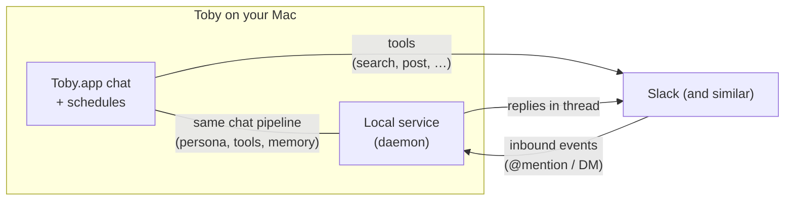

# Chat surfaces

**Chat surfaces** are external messaging apps—today primarily **Slack**—that Toby can both **use as tools** and **listen to as a conversation channel**. This page is the map for that story. Provider-specific credentials and app setup live in the [Slack](../integrations/slack) guide; global switches live under [Inbound chat](../configuration/inbound-chat).

## Two directions

| Direction | What it means | Who starts the conversation |
| --------- | ------------- | --------------------------- |
| **Outbound (tools)** | From Toby.app (or schedules), the model searches channels, reads history, or posts messages through the chat integration | You, in Toby |
| **Inbound (@mentions)** | Someone messages or @mentions Toby in Slack; the local service runs a full chat turn and replies in the thread | Coworkers (or you) in Slack |

You can enable **tools only**, **inbound only**, or **both**. They use related but **not identical** credentials—especially on Slack.

## Outbound: use Slack from Toby

1. Connect the [Slack](../integrations/slack) integration (OAuth is recommended for chat tools).
2. In Toby.app chat, ask about channels, history, or posting—or scope with the integration picker / `slack …` prefix.
3. Optionally set **Chat** as your [default provider](../configuration/default-providers) under **Settings → Default Providers** when multiple chat apps exist later.

Outbound tools do **not** require inbound to be on. For Slack, OAuth stores a **user** token so actions run as **you**, not as a bot (unless you use the bot-token auth path for tools).

**Deep dive:** [Slack integration](../integrations/slack) — app manifest, OAuth, scopes, Connect.

## Inbound: let Slack drive Toby

Inbound turns use the **same** assistant pipeline as the Mac app: persona, skills, memory, and other connected integrations (for example “check my email” from a Slack mention can still load Email tools).

### Requirements (conceptual)

1. **Local service running** — Toby.app normally starts it; inbound listens in the background.
2. **Global inbound settings** — **Settings → Chat**: enable, pick **Active integration** (e.g. Slack), choose a **persona**.  
   Details: [Inbound chat](../configuration/inbound-chat).
3. **Integration connected** and inbound-capable credentials filled in (Slack needs **bot + app tokens** and Socket Mode—not just OAuth user token).  
   Details: [Slack → Inbound @mentions](../integrations/slack#inbound-mentions).

### What users experience

- @mention Toby (or message the bot per your Slack app setup) in a channel or thread.
- Toby processes the turn under the inbound persona and replies in context.
- Conversation maps to a Toby session keyed by the external thread so follow-ups stay coherent.

Only **one** inbound integration is active globally at a time.

### How conversations map to Toby sessions

Inbound does **not** invent a new chat every time someone talks to Toby, and it does **not** merge unrelated threads by topic. It ties each **external conversation identity** (Slack workspace + channel + thread, or a whole DM) to one Toby chat session so history stays continuous.

| Where you talk | What becomes “one conversation” | What continues that session |
| -------------- | -------------------------------- | --------------------------- |
| **Channel or group** | One **Slack thread** (started by an @mention, or an existing thread Toby already joined) | Further messages in **that same thread**—another @mention is not required once Toby owns the thread |
| **Direct message with the Toby app** | The **entire 1:1 DM** (normal top-level messages) | Every message you send in that DM—no @mention required |

**Practical notes:**

- A **new** top-level @mention in a channel starts a **new** thread and a **new** Toby session. A different channel or a different thread is a different session.
- Top-level channel chatter **without** an @mention is ignored (it does not open a session).
- DMs with the bot feel like one long chat: the first message creates the session; later messages reuse it (there is no automatic “reset after idle”).
- If you **delete** that chat session inside Toby.app, the next Slack message on the same thread/DM starts a **fresh** empty session linked to the same Slack place.
- If Toby asks a clarifying question (`askUser`), reply in the **same** thread or DM—your answer continues that turn rather than starting a disconnected chat.

Provider setup and tokens: [Slack → Inbound @mentions](../integrations/slack#inbound-mentions). Global switches: [Inbound chat](../configuration/inbound-chat).

## Slack checklist (both modes)

Use this when you want Slack as a full chat surface:

| Step | Tools (outbound) | Inbound |
| ---- | ---------------- | ------- |
| Create Slack app (manifest recommended) | Yes | Yes (include bot + Socket Mode) |
| OAuth Client ID/Secret + **Connect** | Recommended | Optional for tools; still useful |
| Bot Token (`xoxb-…`) | Bot-token auth path only | **Required** |
| App Token (`xapp-…`, Socket Mode) | No | **Required** |
| **Settings → Chat** enable + active = Slack | No | **Required** |
| Setup Guide in Toby.app | Recommended | Recommended |

Step-by-step Slack UI and token tables: **[Slack](../integrations/slack)**.  
Global switches only: **[Inbound chat](../configuration/inbound-chat)**.

## How this fits the rest of Toby

| Topic | Role with chat surfaces |
| ----- | ----------------------- |
| [Personas](../personas) | Inbound uses the persona selected under Settings → Chat (or default) |
| [Default providers](../configuration/default-providers) | Prefer Slack for the **Chat** category in multi-integration chat and schedules |
| [Schedules](../schedules) | Can use Slack tools on a cron; inbound is separate (event-driven) |
| [Architecture](../architecture/overview) | Daemon + plugins share one harness; inbound is a long-lived plugin process |
| [Plugins](../plugins/creating-a-plugin) | New chat apps implement protocol tools and optional `inbound run` |

## Adding another chat app later

Slack is the reference **Chat** provider. A future messaging integration would:

1. Ship as a plugin with chat tools and `providerCategories: ["chat"]`.
2. Optionally implement inbound (Socket Mode / webhooks / long-lived `inbound run`) so it can appear under **Active integration**.
3. Follow the same split: **Connect** for tools, **Settings → Chat** for listening.

Until then, treat [Slack](../integrations/slack) as the complete setup guide and this page as the product overview.

## Related

- [Slack](../integrations/slack) — credentials, app setup, inbound deep dive  
- [Inbound chat](../configuration/inbound-chat) — Settings → Chat  
- [Integrations overview](../integrations/overview) — provider categories  
- [Configure and connect](../getting-started/configure-and-status) — general connect pattern  
- [Your first chat](../getting-started/first-chat) — chatting inside Toby.app  
- [Toby.app](../toby-app) — native UI and local service  
