# AI prompt caching and token telemetry

Toby configures **provider prompt caching** for `toby chat` and normalizes **cache-related token usage** for the Ink UI and turn logs. This is separate from **tool-result caching** (read-only tool outputs); see [chat-pipeline.md](chat-pipeline.md#tool-result-cache).

## Module layout

| Path | Role |
| --- | --- |
| [`packages/core/src/ai/caching/index.ts`](../packages/core/src/ai/caching/index.ts) | Orchestrator entry: `applyChatPromptCaching`, public exports |
| [`packages/core/src/ai/caching/types.ts`](../packages/core/src/ai/caching/types.ts) | `CacheAdapter`, `TokenUsageReport`, `ChatCacheContext` |
| [`packages/core/src/ai/caching/registry.ts`](../packages/core/src/ai/caching/registry.ts) | Maps `persona.ai.provider` → adapter |
| [`packages/core/src/ai/caching/shared.ts`](../packages/core/src/ai/caching/shared.ts) | Stable `promptCacheKey`, `mergeProviderOptions`, gateway slug parsing |
| [`packages/core/src/ai/caching/usage.ts`](../packages/core/src/ai/caching/usage.ts) | `extractTokenUsageReport`, status-line and debug formatting |
| [`packages/core/src/ai/caching/adapters/openai.ts`](../packages/core/src/ai/caching/adapters/openai.ts) | Direct OpenAI |
| [`packages/core/src/ai/caching/adapters/vercel-gateway.ts`](../packages/core/src/ai/caching/adapters/vercel-gateway.ts) | Vercel AI Gateway |

[`packages/core/src/ai/cache-hints.ts`](../packages/core/src/ai/cache-hints.ts) re-exports the orchestrator for older imports; new code should import from `packages/core/src/ai/caching`.

## End-to-end flow

```mermaid
flowchart LR
  runTurn["runSharedChatTurn"]
  apply["applyChatPromptCaching"]
  adapter["CacheAdapter"]
  chat["chatWithTools / streamText"]
  usage["LanguageModelUsage"]
  report["TokenUsageReport"]
  ui["Chat input dock / logs"]

  runTurn --> apply
  apply --> adapter
  adapter -->|"providerOptions patch"| chat
  chat --> usage
  usage --> report
  report --> ui
```



1. **Before the model call** — **RunModelTurnNode** (via [`run-turn.ts`](../packages/core/src/chat-pipeline/run-turn.ts)) calls `applyChatMessageCaching` on the message list, then `applyChatPromptCaching` with the active persona and integration module names.
2. **Adapter** — Looks up `getCacheAdapter(persona.ai.provider)` and merges provider-specific message hints and `providerOptions` patches.
3. **Model call** — [`packages/core/src/ai/chat.ts`](../packages/core/src/ai/chat.ts) forwards `providerOptions` to the AI SDK (`streamText` / `generateText`).
4. **After the turn** — Callers use `extractTokenUsageReport(usage, { persona, moduleNames })` for logging and UI instead of reading `usage.inputTokenDetails` directly.

## Provider adapters

Each adapter implements [`CacheAdapter`](../packages/core/src/ai/caching/types.ts):

- **`applyProviderOptions`** — Returns a `providerOptions` object to merge (or `undefined` if this provider has nothing to add for the current model).
- **`normalizeUsageReport`** (optional) — Override how AI SDK usage maps into `TokenUsageReport`. All current adapters use the default mapping.

Register new providers in [`packages/core/src/ai/caching/registry.ts`](../packages/core/src/ai/caching/registry.ts).

### OpenAI (`provider: "openai"`)

Sets:

```typescript
providerOptions: {
  openai: {
    promptCacheKey: "toby-chat-v2-<digest>",
  },
}
```

OpenAI uses this key with the prompt prefix hash to improve cache hit rates. See [OpenAI prompt caching](https://developers.openai.com/docs/guides/prompt-caching).

### Vercel AI Gateway (`provider: "vercel"`)

Every gateway request sets:

```typescript
providerOptions: {
  gateway: { caching: "auto" },
}
```

This matches [Vercel automatic caching](https://vercel.com/docs/ai-gateway/models-and-providers/automatic-caching): the gateway applies explicit cache markers for Anthropic/MiniMax and leaves implicit providers (OpenAI, Google, DeepSeek) unchanged.

Additional patches by upstream model slug (`provider/model`):

| Upstream prefix | Extra configuration |
| --- | --- |
| `openai/…` | `openai.promptCacheKey` (same stable key as direct OpenAI) |
| `anthropic/…`, `minimax/…` | `cacheControl: { type: "ephemeral" }` on the first `system` message (belt-and-suspenders with `gateway.caching`) |
| `google/…`, `deepseek/…`, others | Gateway auto caching only |

The Vercel adapter also reads `usage.raw` when the AI SDK omits `inputTokenDetails.cacheReadTokens` (common through the gateway).

> Note: `@ai-sdk/gateway` may not yet list `caching` on `GatewayProviderOptions` in TypeScript ([vercel/ai#14595](https://github.com/vercel/ai/issues/14595)), but the gateway HTTP API accepts it and Toby passes it through in the request body.

## Stable cache key

Built in [`buildStablePromptCacheKey`](../packages/core/src/ai/caching/shared.ts). The key is:

- **Stable** across sessions for the same persona, model, and integration set
- **Independent of user text** (maximizes prefix reuse)
- **Sensitive to persona changes** via a short hash of name, prompt mode, and instructions

Intentionally **excluded**:

- User prompt text
- Dynamic integration context (task snapshots, tool results)
- Per-turn or per-session state

OpenAI enforces a 64-character limit on `prompt_cache_key`; Toby keeps the key short with a schema version prefix and base64url digest.

If you change the stable system prompt layout in a breaking way, bump `DEFAULT_CHAT_PROMPT_SCHEMA_VERSION` in [`packages/core/src/ai/caching/shared.ts`](../packages/core/src/ai/caching/shared.ts).

## Token usage contract (`TokenUsageReport`)

All providers report through the same shape:

| Field | Meaning |
| --- | --- |
| `inputTokens` | Total input tokens |
| `outputTokens` | Total output tokens |
| `totalTokens` | Total tokens |
| `cacheReadTokens` | Input tokens served from the provider prompt cache |
| `cacheWriteTokens` | Input tokens written to the prompt cache on this request |
| `noCacheTokens` | Input tokens not served from cache |

Default extraction reads AI SDK [`LanguageModelUsage`](https://sdk.vercel.ai/docs/reference/ai-sdk-core/language-model-usage) (`inputTokenDetails.cacheReadTokens`, etc.). Providers that need custom parsing can implement `normalizeUsageReport` on their adapter.

### UI status line

[`formatTokenUsageStatus`](../packages/core/src/ai/caching/usage.ts) drives the chat input dock footer, for example:

```text
in=21381 out=116 tot=21497 cache=60 cacheW=0
```

- **`cache`** — `cacheReadTokens`
- **`cacheW`** — `cacheWriteTokens` (only shown when &gt; 0, so a warm-up turn may show `cache=0 cacheW=…`)

### Debug transcript

Set `TOBY_DEBUG_CACHE=1` to append a meta line per turn with `cacheRead`, `cacheWrite`, and `noCache` via [`formatCacheDebugMeta`](../packages/core/src/ai/caching/usage.ts) in [`apps/cli/src/ui/chat/chat-session-app.tsx`](../apps/cli/src/ui/chat/chat-session-app.tsx).

### Turn logs

[`logTurnSummary`](../apps/cli/src/logging/chat-log.ts) receives `cacheReadTokens` and `cacheWriteTokens` from `extractTokenUsageReport` in the chat session app.

## Expected behavior

On models that support prompt caching:

1. **First similar turn** — Often high `cacheWriteTokens`, low or zero `cacheReadTokens` (cache warm-up). The dock may show `cache=0 cacheW=…`.
2. **Later turns** with the same cached prefix — Rising `cacheReadTokens`, lower `noCacheTokens`, and a non-zero `cache` in the status line when the upstream reports cached tokens.

If `cache` stays at zero across many similar turns, check:

- Persona provider and model (gateway vs direct OpenAI)
- Whether the upstream returns `cached_tokens` / equivalent in usage (gateway must pass it through)
- `TOBY_DEBUG_CACHE=1` for cache breakdown plus `usage.raw` and `providerMetadata` in the transcript
- Prefix stability: changing the system message each turn (for example skill appendix injection) reduces cache hits even when caching is enabled

## Adding a provider adapter

1. Create `packages/core/src/ai/caching/adapters/<id>.ts`:

```typescript
import type { CacheAdapter } from "../types";

export const myProviderCacheAdapter: CacheAdapter = {
  providerId: "my-provider",

  applyProviderOptions(params) {
    // Return merged providerOptions, or undefined if no hints for this model.
  },

  // Optional:
  // normalizeUsageReport(params) { ... }
};
```

2. Register in [`packages/core/src/ai/caching/registry.ts`](../packages/core/src/ai/caching/registry.ts).
3. Add tests in [`tests/ai/prompt-caching.test.ts`](../tests/ai/prompt-caching.test.ts).
4. Document upstream-specific options in this file.

Keep provider-specific API details inside the adapter; the chat pipeline and UI should only use `applyChatPromptCaching`, `extractTokenUsageReport`, and the format helpers.

## Related tests

- [`tests/ai/prompt-caching.test.ts`](../tests/ai/prompt-caching.test.ts) — Adapter patches and usage formatting
