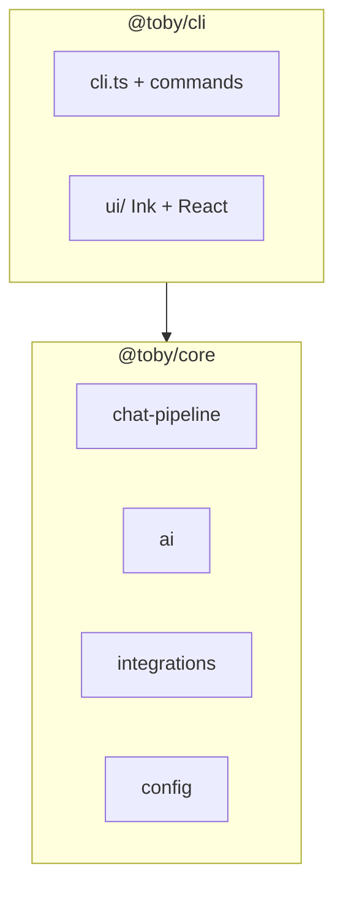

# Architecture

Toby is a **Commander.js** CLI (`@toby/cli`) built on a shared harness package (`@toby/core`). The harness holds everything needed to run chat turns, integrations, and headless/daemon flows **without** Ink or React. The CLI app adds terminal UI, command registration, and macOS-specific app wiring.

See also: [Core vs apps](#core-vs-apps) (where new code should live).

## Core vs apps

| Package | Path | Role |
| ------- | ---- | ---- |
| **`@toby/core`** | [`packages/core/src/`](../packages/core/src/) | Harness: chat pipeline, AI, integrations, config, personas, skills, memory, planning, chat-inbound, logging, session store, message prep. Consumable from scripts, daemons, or other apps via `@toby/core/...` imports. |
| **`@toby/cli`** | [`apps/cli/src/`](../apps/cli/src/) | CLI app: Commander entry, generic commands, Ink TUIs (`ui/`), schedules/upgrade UI and glue. Depends on `@toby/core`; must not be imported by core. |



**Put in core** when the behavior is UI-agnostic: model calls, tools, integration APIs, pipeline nodes, SQLite persistence, daemon inbound routing, pretreatment, prompt caching.

**Put in the CLI app** when the behavior is presentation or shell-specific: transcript rows, slash commands, configure/schedules Ink screens, `ViewFrame` / keybindings, upgrade handoff, readline `--no-tui` formatting that is not shared headless logic.

Integration **implementations** live in core (`packages/core/src/integrations/<name>/`). Integration **Ink pickers** and **slash commands** stay in the CLI under `apps/cli/src/ui/`.

## High-level layout

```
packages/core/src/       # @toby/core — harness (no Ink/React)
  chat-pipeline/         # Node pipeline (turn init → expand → assemble → run → persist)
  ai/                    # Shared AI helpers (chat, providers, pretreatment, replay)
  integrations/          # Integration modules + registry (see integrations.md)
  config/                # Read/write ~/.toby/config.json and credentials.json
  chat-inbound/          # Provider-agnostic daemon inbound router
  session-store.ts       # SQLite chat sessions (TUI + headless)
  prepare-messages.ts    # Message assembly for chat turns
  chat-integrations.ts   # Resolve usable chat modules from config/registry
  …

apps/cli/src/
  cli.ts                 # Program entry: registers commands, loads integration CLI hooks
  commands/              # Cross-integration Commander commands (connect, chat, daemon, …)
  ui/configure/          # Ink TUI for `toby configure`
  ui/chat/               # Ink TUI for `toby chat` (events → transcript; not the pipeline itself)
  ui/shared/             # Shared Ink primitives (CLI-only)
  schedules/ listen/ upgrade/ releases/   # App-specific orchestration and UI glue
```

**Tests:** Vitest suites for the CLI live in [`apps/cli/tests/`](../apps/cli/tests/). Import harness symbols from `@toby/core/...`.

**Build**

- **`bun run build`** (in `apps/cli`) — `bun build` bundles [`apps/cli/src/cli.ts`](../apps/cli/src/cli.ts) to `apps/cli/dist/cli.js` (the `toby` bin). Release binaries use `bun build --compile` from the same entrypoint (see [`docs/build-executable.md`](build-executable.md)).
- **`bun run build:executable`** — optional single-file native binary via `bun build --compile` (see [build-executable.md](build-executable.md)).

## Runtime flow

1. **`apps/cli/src/cli.ts`** constructs the Commander program, registers built-in commands, then calls `registerCommands` on each loaded `IntegrationModule` (if present). When no subcommand is provided on the command line, `chat` is used as the default.
2. **Connect / disconnect / status** use [`getIntegration`](../packages/core/src/integrations/index.ts) or [`getIntegrations`](../packages/core/src/integrations/index.ts) from core.
3. **`summarize`** resolves a module by name, checks capabilities, and runs AI with returned messages (core integrations + core AI).
4. **`chat`** ([`apps/cli/src/commands/chat.ts`](../apps/cli/src/commands/chat.ts)) resolves integrations, then either runs the Ink session ([`ui/chat/`](../apps/cli/src/ui/chat/)) or a console one-shot. Each turn is orchestrated by [`runChatTurnPipeline`](../packages/core/src/chat-pipeline/pipeline.ts) in core. The CLI subscribes to `ChatEvent`s for rendering; it does not reimplement pipeline stages.
5. **`config`** launches the configure UI (`ui/configure/`), while backup/restore logic stays in CLI commands using core config helpers.

## Local data

| Location | Role |
| -------- | ---- |
| `~/.toby/config.json` | Integration connection flags, personas |
| `~/.toby/credentials.json` | API keys, OAuth client secrets, OpenAI token |
| `~/.toby/chat.sqlite` | Chat session storage (sessions, messages, transcript) |
| `~/.toby/toby.log` | JSON-lines chat session log (turns, tools, prep) |
| `~/.toby/daemon.log` | JSON-lines daemon log (scheduler, inbound chat, Slack Socket Mode) |

Access is centralized in [`packages/core/src/config/index.ts`](../packages/core/src/config/index.ts). Integration modules should not hardcode paths; use the config helpers.

Backup and restore behavior is documented in [`commands.md`](commands.md).

## UI stack (CLI app only)

Ink/React lives under **`apps/cli/src/ui/`** only. Shared primitives are in [`apps/cli/src/ui/shared/`](../apps/cli/src/ui/shared/): `ViewFrame`, `ViewModal`, `ConfirmDialog`, row components, key predicates, glyphs. See [`docs/ui.md`](ui.md).

The configure tree is built in [`apps/cli/src/ui/configure/items.ts`](../apps/cli/src/ui/configure/items.ts) using credential descriptors from the **core** integration registry.

Chat slash commands are registered in [`apps/cli/src/ui/chat/slash-commands/`](../apps/cli/src/ui/chat/slash-commands/) (CLI-only; see [`slash-commands.md`](slash-commands.md)).

## AI stack (core)

Shared AI and pipeline code lives under **`packages/core/src/ai/`** and **`packages/core/src/chat-pipeline/`**:

- [`model-factory.ts`](../packages/core/src/ai/model-factory.ts) — language models from persona config.
- [`chat.ts`](../packages/core/src/ai/chat.ts) — tool-assisted chat (`streamText` / `generateText`, tool cache, lifecycle hooks).
- [`ask-user-tool.ts`](../packages/core/src/ai/ask-user-tool.ts) — **Ask User** tool; the CLI supplies an Ink or readline handler when wiring the turn context.
- [`providers.ts`](../packages/core/src/ai/providers.ts) — provider/model lists (configure UI reads these via core).

Integration-specific **prompts** and **tool definitions** live under `packages/core/src/integrations/<name>/` so the harness stays integration-agnostic.

For pipeline stages, events, and caching, see [`chat-pipeline.md`](chat-pipeline.md) and [`ai-caching.md`](ai-caching.md).
