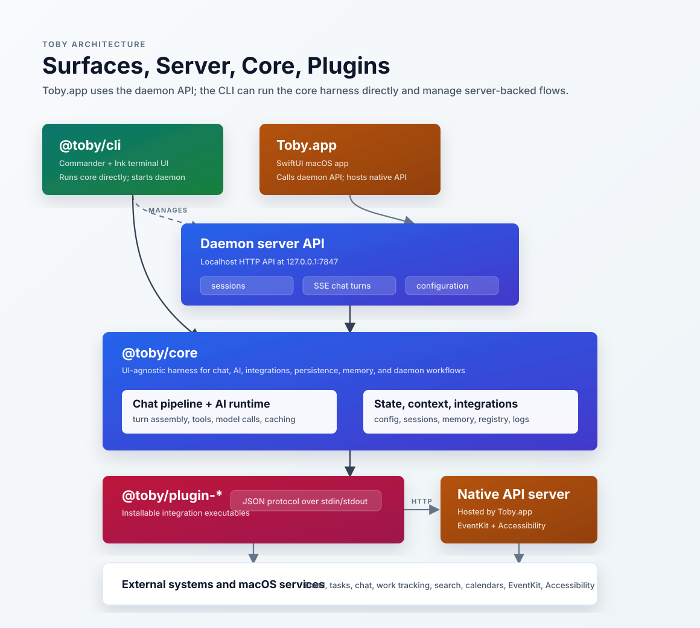
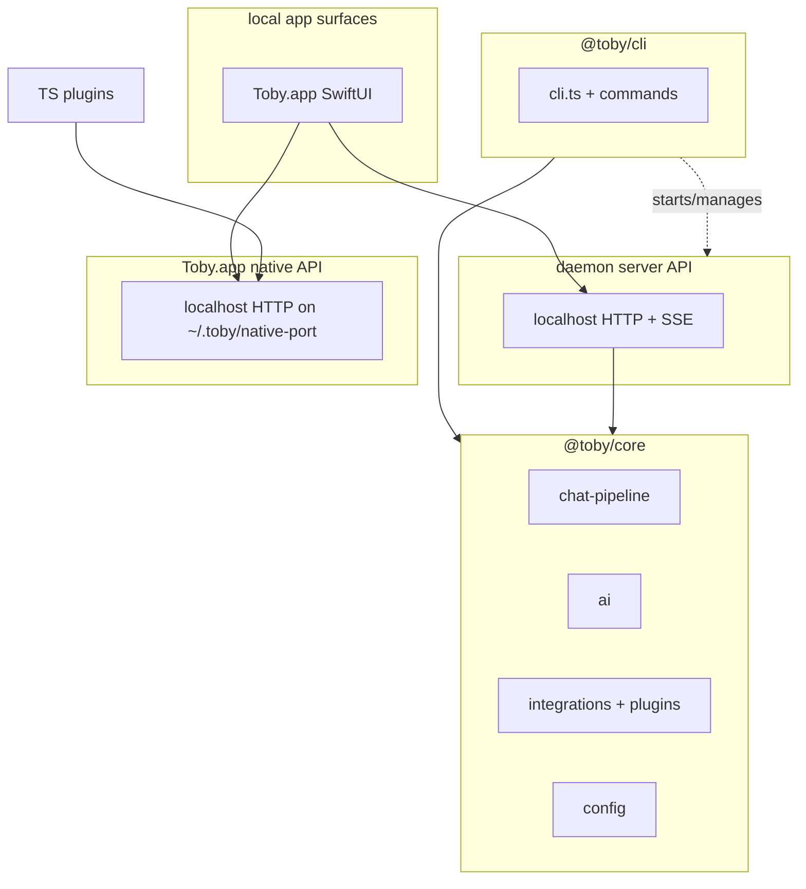
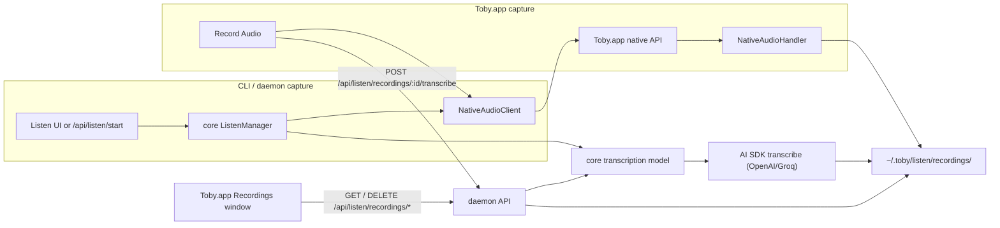

# Architecture

Toby is a native macOS app plus a **Commander.js** maintenance CLI (`@toby/cli`) built on a shared harness package (`@toby/core`). The harness holds everything needed to run chat turns, integrations, and headless/daemon flows without UI dependencies. The CLI app adds command registration and macOS-specific app wiring.

See also: [Core vs apps](#core-vs-apps) (where new code should live) and
[`server-api.md`](server-api.md) (the localhost API used by
Toby.app).



## Core vs apps

| Package | Path | Role |
| ------- | ---- | ---- |
| **`@toby/core`** | [`packages/core/src/`](../packages/core/src/) | Harness: chat pipeline, AI, integrations, config, personas, skills, memory, planning, chat-inbound, logging, session store, message prep. Consumable from scripts, daemons, or other apps via `@toby/core/...` imports. |
| **`@toby/cli`** | [`apps/cli/src/`](../apps/cli/src/) | CLI app: Commander entry, generic commands, daemon/schedules/upgrade glue, and native app launch. Depends on `@toby/core`; must not be imported by core. |
| **`Toby.app`** | [`apps/toby-app/`](../apps/toby-app/) | Native macOS app (SwiftUI) with a real bundle identity. Uses the daemon localhost API for chat/configuration/recordings and runs a separate **native API server** for TCC-gated operations (EventKit calendar/reminders, Contacts.framework, Accessibility, microphone, system audio, and all macOS system controls). `toby-plugin-macos`, `toby-plugin-applecalendar`, `toby-plugin-applecontacts`, and `toby-plugin-applereminders` are TypeScript bun-package plugins that delegate to this server. It does not import core. See [`native-helpers.md`](native-helpers.md). |



**Put in core** when the behavior is UI-agnostic: model calls, tools, integration APIs, pipeline nodes, SQLite persistence, daemon inbound routing, pretreatment, prompt caching.

**Put in the CLI app** when the behavior is shell-specific: Commander wiring, backup/restore prompts, daemon management commands, release upgrade handoff, and native app launch helpers.

Integration **implementations** live in installable plugins (`apps/plugin-*`);
core owns the registry adapter under `packages/core/src/integrations/plugins/`.
Interactive integration configuration belongs in Toby.app through the core
configure API.

## High-level layout

```
packages/core/src/       # @toby/core — UI-agnostic harness
  chat-pipeline/         # Node pipeline (turn init → expand → assemble → run → persist)
  ai/                    # Shared AI helpers (chat, providers, pretreatment, replay)
  integrations/          # Integration modules + registry (see integrations.md)
  config/                # Read/write ~/.toby/config.json and credentials.json
  chat-inbound/          # Provider-agnostic daemon inbound router
  session-store.ts       # SQLite chat sessions (native + headless)
  prepare-messages.ts    # Message assembly for chat turns
  chat-integrations.ts   # Resolve usable chat modules from config/registry
  …

apps/cli/src/
  cli.ts                 # Program entry: registers commands, loads integration CLI hooks
  commands/              # Cross-integration Commander commands (connect, daemon, app, …)
  schedules/ listen/ upgrade/ releases/   # CLI orchestration and maintenance helpers

apps/toby-app/             # Toby.app — native macOS app (SwiftUI)
  Sources/TobyApp/
    Native/                       # Localhost native API (TCC-gated)
      NativeServer.swift          # Port published to ~/.toby/native-port
      NativeCalendarHandler.swift # EventKit calendar operations
      NativeContactsHandler.swift # Contacts.framework operations
      NativeAppleRemindersHandler.swift # EventKit reminders
      NativeMacOSHandler.swift    # Accessibility-gated window operations
      NativeAudioHandler.swift    # Microphone / system audio capture
    # Plus Features/, Stores/, UI/, … — product surfaces (chat, settings, recordings)
```

### Native app shared data

Toby.app owns long-lived SwiftUI stores at the root scene level and preloads
shared list/index data only after daemon bootstrap succeeds. Dashboard metrics,
the dashboard sidebar, top-level sidebars, and the command palette all read from
those shared stores instead of relying on each feature view to hit the daemon
first.

The shared preload covers chat sessions, schedules, recording summaries,
memory summaries, skill summaries, project summaries/sessions, and integration
sections. Feature views still call idempotent `ensureLoaded()` fallbacks, but
they are not the primary source of global data population.

Keep expensive detail data lazy in feature-specific stores: recording
transcripts, selected memory detail/explanations, skill bodies, project file
trees, and schedule run transcripts should be fetched only when the user opens
the detail surface that needs them.

**Tests:** Vitest suites for the CLI live in [`apps/cli/tests/`](../apps/cli/tests/). Import harness symbols from `@toby/core/...`.

**Build**

- **`bun run build`** (in `apps/cli`) — `bun build` bundles [`apps/cli/src/cli.ts`](../apps/cli/src/cli.ts) to `apps/cli/dist/cli.js` (the `toby` bin). Release binaries use `bun build --compile` from the same entrypoint (see [`docs/build-executable.md`](build-executable.md)).
- **`bun run build:executable`** — optional single-file native binary via `bun build --compile` (see [build-executable.md](build-executable.md)).

## Runtime flow

1. **`apps/cli/src/cli.ts`** constructs the Commander program, registers built-in maintenance commands, then calls `registerCommands` on each loaded `IntegrationModule` (if present). Bare `toby` (no subcommand) opens the native Toby app.
2. **Connect / disconnect / status** use [`getIntegration`](../packages/core/src/integrations/index.ts) or [`getIntegrations`](../packages/core/src/integrations/index.ts) from core (discovered plugins).
3. **Chat and configuration** are interactive native-app workflows backed by core web/API handlers (daemon HTTP API).
4. **`config backup` / `config restore`** stay in CLI commands using core config helpers.
5. **Daemon** (`toby daemon start`) runs schedules, inbound chat, and the localhost API that Toby.app consumes.

## Local data

| Location | Role |
| -------- | ---- |
| `~/.toby/config.json` | Integration connection flags, personas |
| `~/.toby/credentials.json` | API keys, OAuth client secrets, OpenAI token |
| `~/.toby/chat.sqlite` | Chat session storage (sessions, messages, transcript) |
| `~/.toby/logs/toby.log` | Unified JSON-lines log for all subsystems (chat, daemon, server events, upgrade, native-app, macOS plugin). A `source` field discriminates the emitter; rotation is shared. |
| `~/.toby/listen/recordings/<id>/` | Saved audio, metadata, and transcript artifacts. |
| `~/.toby/native-port` | Ephemeral port published by Toby.app's native permission/audio server. |
| `~/.toby/projects/<slug>/` | Project metadata, reference context, local skills, and generated outputs. |

Access is centralized in [`packages/core/src/config/index.ts`](../packages/core/src/config/index.ts). Integration modules should not hardcode paths; use the config helpers.

Backup and restore behavior is documented in [`commands.md`](commands.md).

## Daemon server API

The daemon exposes a local HTTP API for non-terminal surfaces:

- **`Toby.app`** checks `/api/status`, starts `toby daemon start` when needed,
  then calls the same session, chat, persona, and configure endpoints.
- Interactive chat turns stream `ChatEvent` payloads over SSE from
  `/api/sessions/:id/turn`.

The API binds to `127.0.0.1` and uses the local trust model documented in
[`server-api.md`](server-api.md).

## Native macOS app (Toby.app)

**`apps/toby-app/`** builds **Toby.app**, a SwiftUI macOS app with a proper
bundle identity and `Info.plist`. It is both a native user surface and a native
permission bridge:

- **User surface:** `TobyClient.swift` calls the daemon server API for status,
  sessions, streaming chat turns, personas, configuration, and recording
  list/detail/transcription/deletion. If the daemon is not available,
  `DaemonBootstrap.swift` starts it through `toby daemon start`.
- **Permission bridge:** while running, Toby.app exposes a localhost HTTP
  **native API server** for operations that require macOS TCC permissions
  (Calendar/EventKit, Contacts.framework, Accessibility) which raw CLI plugin binaries cannot
  perform reliably — macOS ties permission grants to the calling binary's
  identity.

- **Discovery:** Toby.app writes its random port to `~/.toby/native-port`; clients confirm liveness via `GET /api/native/health`.
- **Routing:** the macOS-facing plugins (`toby-plugin-applecalendar`, `toby-plugin-applecontacts`, `toby-plugin-applereminders`, `toby-plugin-macos`) are TypeScript bun-package plugins that delegate **all** operations to Toby.app's native API server and **auto-launch** it on demand when it is not running.
- **Fallback:** neither plugin has an in-process fallback. Both auto-launch Toby.app and wait for the native server to become available.
- **Relationship to core:** Toby.app does **not** import `@toby/core`. It uses
  the daemon API for product behavior and is reached by plugins over its native
  API only for permission-gated macOS calls, so the harness and the plugin
  protocol stay unchanged.

See [`native-helpers.md`](native-helpers.md) for the full endpoint table and source map.

## Recording and transcription architecture

Toby has one capture implementation (inside Toby.app) but two entry points and
one transcription boundary:



- The CLI/core path routes recording through Toby.app's native API server so
  microphone and system audio capture share the same stable bundle identity.
- Both paths write `metadata.json`, source tracks, and preferably
  `combined.m4a` under the same recording directory layout.
- Transcription is harness behavior. The daemon resolves combined audio first,
  then microphone or system WAV fallbacks, and calls the AI SDK's `transcribe`
  with the provider/model configured under **Settings → Transcription**
  (OpenAI or Groq). WAV input bypasses unnecessary `afconvert` conversion.
  When no model is configured, audio is saved with a metadata note and no
  transcript.
- The native Recordings window never parses or deletes recording directories
  itself. `RecordingsStore` uses `TobyClient`, and the daemon owns list, detail,
  transcription, and deletion operations.

See [`listen.md`](listen.md) for user-facing behavior and
[`server-api.md`](server-api.md#listen-and-recordings) for the HTTP contract.

## UI stack

Interactive UI lives in **`apps/toby-app/`**. The CLI has no terminal UI and should not depend on UI framework packages.

The configure tree is built in [`packages/core/src/configure/tree.ts`](../packages/core/src/configure/tree.ts) using credential descriptors from the **core** integration registry and is exposed to Toby.app through the local web API.

## AI stack (core)

Shared AI and pipeline code lives under **`packages/core/src/ai/`** and **`packages/core/src/chat-pipeline/`**:

- [`model-factory.ts`](../packages/core/src/ai/model-factory.ts) — language models from persona config.
- [`chat.ts`](../packages/core/src/ai/chat.ts) — tool-assisted chat (`streamText` / `generateText`, tool cache, lifecycle hooks).
- [`ask-user-tool.ts`](../packages/core/src/ai/ask-user-tool.ts) — **Ask User** tool; native/headless turn contexts provide the handler when needed.
- [`providers.ts`](../packages/core/src/ai/providers.ts) — provider/model lists (configure UI reads these via core).

Integration-specific **prompts** and **tool definitions** live in each plugin
package (`apps/plugin-*/`); the harness stays integration-agnostic via the
plugin protocol adapter.

For pipeline stages, events, and caching, see [`chat-pipeline.md`](chat-pipeline.md) and [`ai-caching.md`](ai-caching.md).
