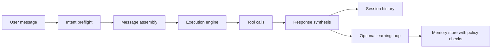
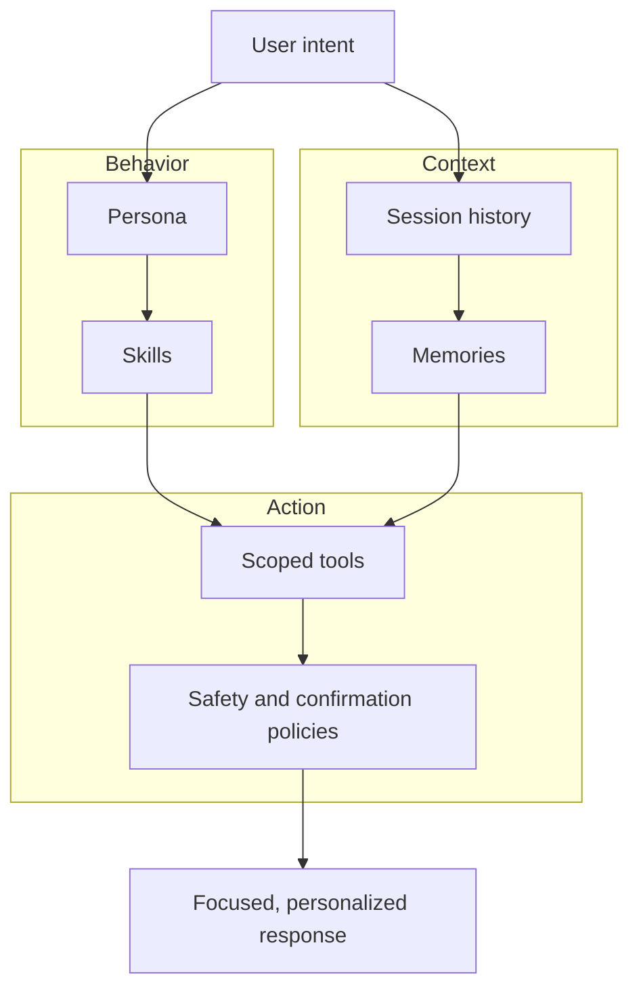

# How Toby Keeps AI Tasks Focused and Personal

Most AI assistants can be smart. Fewer are reliably useful across real daily work.

Toby is designed around that second goal: keep the assistant focused on the task at hand, grounded in the right tools, and personalized to the user over time. The result is not one giant prompt, but a pipeline with layered guardrails.

This post walks through Toby's chat architecture at a high level, with a focus on how personas, skills, memories, and tools work together.

## The Big Picture

Toby treats a chat turn as an orchestration problem:

1. Understand the user's request.
2. Decide what context and capabilities are relevant.
3. Call tools safely when needed.
4. Return a useful answer.
5. Learn carefully for future turns.

Each stage has different responsibilities and constraints. That separation is what makes Toby both flexible and predictable.

## Why Toby Uses Guardrail Layers (Not One Prompt)

A single "do everything" prompt can drift, over-call tools, or miss user nuance. Toby instead uses multiple guardrail layers that reinforce each other:

- **Persona layer** sets behavior, tone, and model/provider defaults.
- **Planning layer** clarifies ambiguous requests before heavy execution.
- **Capability layer** limits available tools to relevant domains.
- **Skill layer** injects deeper instructions only when needed.
- **Memory layer** personalizes responses while applying privacy rules.
- **Tool governance layer** controls write operations, user confirmations, and auditability.

Think of this as a bounded autonomy model: Toby can act, but inside defined lanes.

## Chat Pipeline, Step by Step

### 1) Persona Selection Sets the Operating Mode

A persona is Toby's operating profile for a session. It defines:

- communication style and strategy,
- model/provider selection,
- high-level behavior constraints.

Personas are important guardrails because they make behavior explicit and reusable. Instead of re-explaining preferences every time, users can switch to a persona that already encodes them.

### 2) Intent Preflight Narrows Scope Early

Before the main model turn, Toby may run a lightweight intent pass. This preflight helps identify:

- the user's actual goal,
- likely integrations to involve,
- relevant tools,
- relevant local skills.

This step reduces meandering and helps Toby avoid overloading the model with unnecessary context.

### 3) Message Assembly Balances Stability and Fresh Context

Toby separates stable instructions from dynamic request details:

- stable policy/context stays consistent across turns,
- per-turn task details are injected as user content.

That improves both focus and efficiency. A stable prefix is easier to cache at the provider layer, while dynamic details remain task-specific.

### 4) Execution Engine Runs with Tool-Aware Controls

The main turn runs through an execution engine that can:

- stream responses,
- call tools,
- record tool lifecycle events,
- cancel safely when needed.

Tool calls are not free-form. They are selected from the current integration scope plus global helper tools, then executed with explicit lifecycle boundaries.

### 5) Tool Results Are Reused When Safe

For selected read-only operations, Toby can reuse recent tool outputs for a short period. This gives users faster follow-up answers while avoiding redundant fetches.

Crucially, this is separate from long-term memory. Cache is temporary execution optimization; memory is durable user context.

### 6) Turn Output Is Logged into Session History

After execution, both assistant output and tool result messages become part of the session history. The next turn starts from this grounded state, not from scratch.

This continuity is key for multi-step tasks and iterative workflows.

## Personas, Skills, Memories, and Tools: How They Interlock

These four parts are complementary, not interchangeable.

## 1) Personas: Behavioral and Strategic Guardrails

Personas define _how_ Toby should think and communicate. They shape:

- answer style,
- model/provider behavior,
- baseline policy framing.

They provide consistency across sessions and let users choose the right "working mode" for different contexts.

## 2) Skills: On-Demand Deep Instructions

Skills are modular instruction packs. Toby can surface skill metadata broadly, then load full skill instructions only when they are relevant.

That gives two benefits:

- the model stays lightweight by default,
- deeper procedural guidance appears exactly when required.

In practice, skills act like targeted playbooks that tighten execution quality without bloating every prompt.

## 3) Memories: Personalization with Consent and Provenance

Memory is where Toby becomes personally useful over time, but with strict policy boundaries.

The memory model emphasizes:

- proposal-first writes (not silent direct writes),
- sensitivity classification,
- visibility controls,
- provenance and audit trails,
- explicit forget/edit paths for users.

This means Toby can remember useful preferences and context while still protecting sensitive information.

## 4) Tools: Grounding and Action

Tools connect Toby to external systems (mail, tasks, search, and more). They are the grounding layer for real outcomes.

To keep tools safe and focused, Toby uses:

- scoped tool availability by active integrations,
- always-available global utilities where appropriate,
- read/write distinctions,
- optional user confirmation flows for ambiguous or risky actions.

The net effect: high utility without unconstrained autonomy.

## Guardrails + Personalization as a System

The key insight is that no single layer has to solve everything. Toby gets better outcomes by combining:

- persona-level consistency,
- skill-level specialization,
- memory-level personalization,
- tool-level grounding.

## A Practical Example (Conceptual)

Imagine a user asks:
"Help me clean up my week and draft responses for urgent items."

At a high level, Toby can:

1. Use preflight to detect a planning + communications task.
2. Select relevant integrations and tools.
3. Pull task-relevant memory (for example: preferred tone or scheduling constraints).
4. Load a relevant skill for structured triage if needed.
5. Draft and prioritize with optional user confirmation before sensitive actions.

The user experiences one coherent assistant, but under the hood Toby is coordinating multiple bounded systems.

## Why This Architecture Works

Toby's chat design avoids two common failure modes:

- **Overly generic assistant behavior** by using personas and skills.
- **Unsafe over-personalization** by gating memory with sensitivity and confirmation policies.

And it preserves speed/quality by separating:

- stable prompt context,
- dynamic user task context,
- short-lived execution cache,
- long-lived memory.

That separation keeps the assistant both responsive and trustworthy.

## Closing

If you view AI assistants as products, Toby's core idea is simple:

**Personalization should be earned through policy and structure, not improvised through hidden state.**

By making chat execution modular and guardrail-driven, Toby can stay focused on tasks, adapt to user preferences, and remain auditable as it scales across integrations and workflows.
