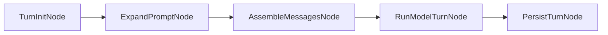
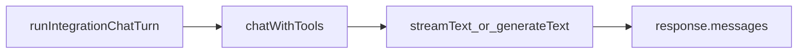

# Chat pipeline (and prompt caching)

This document describes how `toby chat` prepares messages, runs a model turn, and (optionally) takes advantage of provider prompt caching to reduce repeated prompt tokens.

The pipeline implementation lives in **`@toby/core`** ([`packages/core/src/chat-pipeline/`](../packages/core/src/chat-pipeline/)). The CLI Ink session ([`apps/cli/src/ui/chat/`](../apps/cli/src/ui/chat/)) subscribes to `ChatEvent`s for display only. See [`architecture.md`](architecture.md#core-vs-apps).

## Node pipeline architecture

Both the Ink TUI (`toby chat`) and the headless daemon/inbound path run the same **node pipeline** via `runChatTurnPipeline` in [`packages/core/src/chat-pipeline/pipeline.ts`](../packages/core/src/chat-pipeline/pipeline.ts). Each node is a discrete unit with typed inputs and outputs; nodes emit existing `ChatEvent` milestones for observability. Rendering (transcript rows, streaming assistant text) is **not** part of the pipeline — consumers subscribe to the event stream.



| Node | Responsibility | Key implementation |
| ---- | -------------- | ------------------ |
| **TurnInitNode** | Load skills catalog, build tool catalog, decide `shouldPretreat` | [`nodes/turn-init.ts`](../packages/core/src/chat-pipeline/nodes/turn-init.ts) |
| **ExpandPromptNode** | Optional pretreatment; emits `prep_start` / `prep_end` | [`nodes/expand-prompt.ts`](../packages/core/src/chat-pipeline/nodes/expand-prompt.ts), [`pretreatment.ts`](../packages/core/src/ai/pretreatment.ts) |
| **AssembleMessagesNode** | Build/append `CoreMessage[]`, inject skill bodies; emits merge `lifecycle_*` on follow-up turns | [`nodes/assemble-messages.ts`](../packages/core/src/chat-pipeline/nodes/assemble-messages.ts), [`prepare-messages.ts`](../packages/core/src/prepare-messages.ts) |
| **RunModelTurnNode** | Single fused model+tool turn (AI SDK agentic loop) | [`nodes/run-model-turn.ts`](../packages/core/src/chat-pipeline/nodes/run-model-turn.ts), [`run-turn.ts`](../packages/core/src/chat-pipeline/run-turn.ts), [`chat.ts`](../packages/core/src/ai/chat.ts) |
| **PersistTurnNode** | Append messages to SQLite (headless) or emit save `lifecycle_*` (Ink UI) | [`nodes/persist-turn.ts`](../packages/core/src/chat-pipeline/nodes/persist-turn.ts) |

**Query Model** and **Execute Tool** are intentionally **not** separate nodes. They alternate inside a single AI SDK `streamText` / `generateText` call (up to 12 steps) wrapped by `RunModelTurnNode`.

### Core types

Each node implements `PipelineNode<In, Out>`:

```ts
interface PipelineNode<In, Out> {
  readonly name: string;
  run(input: In, ctx: TurnContext): Promise<Out>;
}
```

Payloads chain across stages:

```
TurnRequest → InitedTurn → ExpandedTurn → AssembledTurn → RanTurn → CommittedTurn
```

| Payload | Carries |
| ------- | ------- |
| `TurnRequest` | `rawUserText`, `priorMessages`, `isFirstTurn` |
| `InitedTurn` | Skills catalog, tool catalog, `willPretreat`, integration label |
| `ExpandedTurn` | Effective prompt text, pretreatment `spec`, `prepId` |
| `AssembledTurn` | Full `CoreMessage[]` ready for the model |
| `RanTurn` | Model text, tool calls, `responseMessages`, usage |
| `CommittedTurn` | `messagesAfterTurn` (history + response) |

`TurnContext` holds per-turn services shared by all nodes (persona, modules, dry-run flag, abort signal, `askUser` handler, event sink, optional persistence config). Ink builds context via [`pipeline-turn-context.ts`](../apps/cli/src/ui/chat/pipeline-turn-context.ts); headless uses a daemon-log event adapter.

### Driver and entry points

`runChatTurnPipeline(request, ctx, options?)` chains nodes in order. Options:

- **`stopAfter`** — run only through a given stage (e.g. Ink boot/submit stop at `"assemble"` before updating React state).
- **`assembled`** — skip prep stages and run `RunModelTurnNode` + `PersistTurnNode` from an existing `AssembledTurn` (Ink execution after submit).

| Entry point | Pipeline usage |
| ----------- | -------------- |
| [`headless-session.ts`](../packages/core/src/chat-pipeline/headless-session.ts) | Full pipeline (`init` → `persist`); SQLite batch via `ctx.persist` |
| [`chat-session-app.tsx`](../apps/cli/src/ui/chat/chat-session-app.tsx) boot/submit | `stopAfter: "assemble"`, then `{ assembled }` for model turn |
| [`chat-session-app.tsx`](../apps/cli/src/ui/chat/chat-session-app.tsx) `runModelTurn` | `{ assembled }` only; `emitPersistLifecycle: true`, React effects handle SQLite |

### Observability (`ChatEvent`)

Nodes emit the existing event vocabulary — no new event types. Ink maps events to transcript rows via [`chat-event-reducer.ts`](../apps/cli/src/ui/chat/chat-event-reducer.ts); the daemon logs events at debug level.

| Event family | Emitted by |
| ------------ | ---------- |
| `prep_start` / `prep_end` | ExpandPromptNode |
| `lifecycle_*` | AssembleMessagesNode (merge), RunModelTurnNode (model request), PersistTurnNode (save) |
| `assistant_segment_*` / `assistant_text_delta` | RunModelTurnNode (via `chatWithTools`) |
| `tool_call_start` / `tool_call_complete` | RunModelTurnNode (via tool lifecycle hooks) |

### RunModelTurnNode internals

Inside `RunModelTurnNode`, the model/tool loop is unchanged:




Key files:

- `packages/core/src/chat-pipeline/pipeline.ts`: node types, `runChatTurnPipeline` driver, and stage chaining.
- `packages/core/src/chat-pipeline/nodes/`: discrete turn nodes (`turn-init`, `expand-prompt`, `assemble-messages`, `run-model-turn`, `persist-turn`).
- `packages/core/src/chat-pipeline/headless-session.ts`: daemon/inbound turn entry; builds `TurnContext` and runs the full pipeline.
- `apps/cli/src/ui/chat/chat-session-app.tsx`: Ink TUI; runs prep stages (`stopAfter: "assemble"`) then execution via `{ assembled }`.
- `apps/cli/src/ui/chat/pipeline-turn-context.ts`: helper to build `TurnContext` for the Ink session.
- `packages/core/src/chat-pipeline/chat-events.ts`: shared UI-agnostic chat pipeline event types.
- `packages/core/src/ai/pretreatment.ts`: optional fast pretreatment (`generateText` + structured output) before the main turn; see **Pretreatment** below.
- `packages/core/src/skills/index.ts`: loads optional local skills from `~/.toby/skills/<name>/SKILL.md` (frontmatter `name` + `description`) for pretreatment selection and injection; see **Local skills** below.
- `packages/core/src/prepare-messages.ts`: initial message construction for a session.
- `packages/core/src/chat-pipeline/run-turn.ts`: shared integration turn runner (`runIntegrationChatTurn`, `runSharedChatTurn`). `apps/cli/src/ui/chat/run-turn.ts` re-exports from this module.
- `packages/core/src/ai/chat.ts`: shared wrapper around AI SDK `streamText` / `generateText`, tool cache injection, lifecycle hooks, and abort signal propagation.

## Message construction (stable prefix vs dynamic content)

The chat pipeline intentionally keeps the **system message** as stable as possible, and pushes per-session/per-turn content into **user messages**.

Why:

- Providers that support prompt caching cache a **prefix** of the prompt. The more stable the prefix is across calls, the higher your cache hit rate.
- Any user/session-specific text inside the system prompt tends to break prefix similarity across sessions.

Where this is implemented:

- Gmail system prompt is static policy + tool strategy in `apps/plugin-gmail/src/prompts.ts` (`GMAIL_SINGLE_SESSION_RULES`; adapter wraps persona and global tools).
- Todoist system prompt is static policy + tool rules in `apps/plugin-todoist/src/prompts.ts` (returned from plugin `status.chatModelPrep`).
- Multi-integration system prompt is assembled in `packages/core/src/prepare-messages.ts` and does **not** embed the user request.
- The actual user request (and dynamic context like task snapshots) is always provided via `role: "user"` messages.

## Pretreatment and semantic routing (optional)

Before the main model turn, **ExpandPromptNode** runs **prompt preparation** that narrows **relevant local skills** and **relevant tools**, then **prepends** a compact intent block to the `role: "user"` content sent to the main model. The Ink transcript still shows the **verbatim** user line.

### Default: static semantic routing

By default, Toby uses **embedding-based routing** ([`packages/core/src/routing/`](../packages/core/src/routing/)) instead of an auxiliary LLM on the hot path:

1. **Turn-init** builds the tool catalog and **warms** a static index: tool/skill descriptions are embedded once per catalog signature and stored in SQLite (`routing_embeddings` in [`session-store.ts`](../packages/core/src/session-store.ts)).
2. **Expand-prompt** embeds the user message, runs cosine search, and selects up to **`TOBY_ROUTING_TOP_K`** integration-specific tools (default **8**) plus up to **2** skills above **`TOBY_ROUTING_MIN_SCORE`** (default **0.2**).
3. **Finalize** still applies the token-overlap skill heuristic and unions tools declared in selected skill frontmatter.

**Always-included tools** (~16: `askUser`, memory tools, `loadLocalSkillInstructions`, `tobyList*`, `webSearch`, etc.) are **not** part of the top-K count; they are always passed to the main model regardless of routing. So “top 8” means eight *additional* integration tools, not eight tools total.

| Variable | Purpose |
| -------- | ------- |
| `TOBY_DISABLE_PRETREATMENT=1` | Skip preparation entirely; all tools are exposed to the main model. |
| `TOBY_SEMANTIC_ROUTING=0` | Opt into **legacy LLM pretreatment** (see below). |
| `TOBY_ROUTING_TOP_K` | Max integration-specific tools from semantic search (default `8`). |
| `TOBY_ROUTING_MIN_SCORE` | Minimum cosine similarity (default `0.2`). |
| `TOBY_ROUTING_EMBED_MODEL` | Embedding model (`text-embedding-3-small` or gateway `openai/text-embedding-3-small`). |

Embedding calls use the active persona’s AI provider (OpenAI or Vercel AI Gateway), same credentials as chat.

### Legacy LLM pretreatment (`TOBY_SEMANTIC_ROUTING=0`)

When semantic routing is disabled, **ExpandPromptNode** uses a **small structured LLM** (`gpt-4.1-nano` by default) to extract a full `UserIntentSpec` (goal, must/must-not, assumptions, open questions, integrations, skills, tools). Override with `TOBY_PRETREAT_MODEL`. **Delta** pretreatment (`TOBY_PRETREAT_DELTA=0` to disable) can reuse prior skill/tool scope on follow-ups.

### Shared behavior

- **When**: on **every** non-empty prompt unless `TOBY_DISABLE_PRETREATMENT=1`. [`shouldPretreat`](../packages/core/src/ai/pretreatment.ts) gates this.
- **Follow-up optimization**: trivial messages (`ok`, `yes`, `continue`, …) reuse the prior spec without re-embedding. Non-trivial follow-ups re-run semantic routing (legacy mode may use delta LLM instead).
- **Debug**: `TOBY_DEBUG_PREP=1` adjusts the **prompt preparation** transcript box detail when a spec was attached.
- **Caching**: SQLite **pretreatment cache** (`chat_pretreatment_cache`) stores successful routing results keyed by normalized user text, integration labels, catalog digests, routing mode, and embed/routing parameters — so identical prompts skip re-embedding.
- **Tool filtering**: Selected tools narrow the main turn via [`filterToolsByRelevance`](../packages/core/src/chat-pipeline/run-turn.ts).
- **Session naming**: First-turn session titles use a short heuristic from the user message (semantic mode) or LLM output (legacy mode).

## Local skills (optional)

Markdown skills in `~/.toby/skills/<skill-folder>/SKILL.md` use YAML frontmatter with at least `name` and `description`. Optional frontmatter fields:

- `summary` — concise key instructions appended to the catalog entry.
- `tools` — explicit tool names the skill needs (comma-separated or YAML-ish `- item` bullets).
- `integrations` — integration display labels (e.g. `Gmail`, `Todoist`); every tool belonging to a listed integration is included.

When pretreatment selects a skill, the tools declared by `tools` and `integrations` are **unioned into the turn's `relevantTools`** (see `collectToolsForSelectedSkills` in [`skills/index.ts`](../packages/core/src/skills/index.ts) and `applySkillDeclaredTools` in [`pretreatment.ts`](../packages/core/src/ai/pretreatment.ts)). This makes tool scope deterministic for skill-driven flows instead of relying on the auxiliary model to independently list every needed tool. Declared tool names are validated against the active tool catalog; unknown names are dropped.

There are now two ways skills get into model context:

1. **On-demand tool loading (default path)**:
   - The global prompt includes a compact local skills catalog (`name: description`).
   - The model can call global tool `loadLocalSkillInstructions` with exact names to fetch full `SKILL.md` bodies mid-turn without user intervention.
2. **Pretreatment-selected skills (optional preflight path)**:
   - When pretreatment runs, it may set `relevantSkills` from that catalog.

For each turn:

- The **user** message includes a short “Selected skills” summary (names + descriptions) only when pretreatment selected them.
- The **system** message gains an appendix with the full markdown body of each selected skill (replacing any prior appendix from an earlier turn) only when pretreatment selected them.

If pretreatment is skipped (`shouldPretreat` false) or disabled (`TOBY_DISABLE_PRETREATMENT=1`), skill routing can still happen via `loadLocalSkillInstructions`.

To author a new skill from chat, ask explicitly (for example “create a skill for …”). The global tool **`createLocalSkill`** (see [`packages/core/src/ai/global-chat-tools.ts`](../packages/core/src/ai/global-chat-tools.ts)) is **not** in the always-included tool set: pretreatment must select it, matching Cursor’s `disable-model-invocation` pattern for skills that should not auto-apply.

## Toby self-reflection tools

Global reflection tools let the assistant answer questions about Toby itself without guessing from stale prompt text:

- `tobyListIntegrations` — list available integrations, connection state, categories, capabilities, and resources.
- `tobyGetIntegrationSetup` — explain setup requirements for a specific integration.
- `tobyListDefaults` — show configured default providers by category.
- `tobyListTools` — list tools available in the current chat scope.
- `tobyListSkills` — list installed local skills.

These tools support prompts such as “Which integrations are connected?”, “How do I set up Jira?”, “What tools can you use right now?”, and “What skills are installed?”

### Web content tools (always-included)

Two global tools extend Toby's ability to access the web:

- **`fetchWebContent`** — Fetches a URL and extracts its main readable content using `@mozilla/readability`. Strips ads, navigation, footers, and other boilerplate. Returns article title, text content, excerpt, and metadata. Always available (no credentials needed). Implemented in [`packages/core/src/ai/web-fetch-tool.ts`](../packages/core/src/ai/web-fetch-tool.ts).
- **`webSearch`** — Searches the web using the Brave Search API (via `toby-plugin-websearch`). Returns titles, URLs, descriptions, and optional page age. Available as a **conditional global tool** when the web search plugin is installed and a Brave Search API key is configured. When available, it is always included in the tool set (protected from pretreatment filtering via `ALWAYS_INCLUDED_TOOLS`). See [`web-search.md`](web-search.md), [`apps/plugin-websearch/`](../apps/plugin-websearch/), and [`packages/core/src/integrations/websearch/global-tools.ts`](../packages/core/src/integrations/websearch/global-tools.ts).

Both tools are in the `ALWAYS_INCLUDED_TOOLS` set, so pretreatment's relevance filtering never removes them. The combined system prompt includes routing rules: use `webSearch` when the user asks about current events or research, use `fetchWebContent` when the user shares a URL or asks to read a specific page.

## Turn execution (tools + streaming)

For each user submission:

1. `runChatTurnPipeline` runs **TurnInit → ExpandPrompt → AssembleMessages** (Ink boot/submit stop here; headless continues).
2. **RunModelTurnNode** calls `runIntegrationChatTurn(...)` with the full `messages` array (wiring an `AbortSignal` so the user can cancel with Escape).
3. `runIntegrationChatTurn` resolves integration modules by name, then delegates to `runSharedChatTurn` which merges their tools, adds global tools, applies prompt caching, and calls `chatWithTools(...)`.
4. `chatWithTools` applies `injectToolCache` (read-only tool result cache) then `injectToolLifecycleHooks` (events, callbacks, abort checks), and uses:
  - `streamText(...)` when the Ink UI wants incremental tokens, or
  - `generateText(...)` in non-streaming contexts.
5. Tool lifecycle hooks (`onToolCallStart` / `onToolCallComplete`) and abort-signal checks are implemented by wrapping each tool’s `execute` in `[packages/core/src/ai/chat.ts](../packages/core/src/ai/chat.ts)`. The `abortSignal` on `ChatWithToolsOptions` is propagated to `streamText`/`generateText` and checked before each tool execution. Optional `**onChatEvent**` emits UI-agnostic `[ChatEvent](../packages/core/src/chat-pipeline/chat-events.ts)` values (assistant segments at tool boundaries, tool start/complete, `prep_*`, `lifecycle_*` milestones, etc.). The Ink session maps those events to transcript rows via `[apps/cli/src/ui/chat/chat-event-reducer.ts](../apps/cli/src/ui/chat/chat-event-reducer.ts)` (prep and lifecycle render as boxed pipeline steps in the TUI transcript).
6. **PersistTurnNode** appends `response.messages` to session history (SQLite batch in headless; Ink emits save lifecycle and relies on incremental React persistence).

### Tool result cache (read-only tools)

`toby chat` also has a short-lived in-memory cache for select read-only chat tools:

- **TTL**: 5 minutes
- **Key**: `toolName + stable serialized args`
- **Scope**: SQLite-backed (`chat.sqlite`) so cache survives process restarts until TTL expiry
- **Eligibility**: read-only tool allowlist only (mutating tools and `askUser` are excluded)

Implementation paths:

- Cache implementation: `packages/core/src/chat-pipeline/tool-result-cache.ts`
- Cache lookup/store hook: `packages/core/src/ai/chat.ts` (`injectToolCache` wraps read-only tools; `injectToolLifecycleHooks` emits cache-hit events)
- UI marker: tool transcript rows append `[cache]` when a cached result is used

To clear cached tool results in chat, run:

- `/clear-tool-cache`

### Abort signal

`ChatWithToolsOptions` accepts an optional `abortSignal` (standard `AbortSignal`). When provided:

- The signal is forwarded to `streamText` / `generateText`, so the provider request can be cancelled mid-flight.
- Before each tool execution, the signal is checked; if already aborted the tool throws instead of running.
- The Ink TUI wires an `AbortController` per turn and aborts it when the user presses **Escape** during a loading state.

## Session recording & playback

`toby chat` can record model responses to a JSON file and replay them later **without consuming AI tokens**. This is useful for UI testing, pipeline debugging, and repeatable demos.

### Flags

| Flag | Purpose |
| ---- | ------- |
| `--record <file>` | Record every model call (pretreatment + main turns) to `<file>`. Bare filenames are stored under `~/.toby/recordings/`. |
| `--replay <file>` | Replay recorded model responses from `<file>`. No API key is required. |

The flags are mutually exclusive. Both the Ink TUI and `--no-tui` one-shot mode support record/replay.

Examples:

```bash
# Record a session
toby chat gmail --record inbox-triage.json

# Replay it (tools still run live against real integrations)
toby chat gmail --replay inbox-triage.json

# One-shot replay
toby chat --no-tui --replay inbox-triage.json "same prompt as recording"
```

### What is recorded

Recording intercepts model creation in [`createModelForPersona`](../packages/core/src/ai/model-factory.ts) via AI SDK middleware ([`packages/core/src/ai/replay/`](../packages/core/src/ai/replay/)). Each entry captures either:

- a **`generate`** result (`content`, `finishReason`, `usage`, …), or
- a **`stream`** sequence (ordered stream chunks including text deltas and tool calls).

The file format is versioned JSON (`version: 1`) with metadata (`createdAt`, persona provider/model) and an ordered `entries` array.

Call matching during replay uses a stable digest of normalized request params (prompt messages, tools, settings). Volatile bits are stripped before digesting — for example the injected current-datetime system appendix and cache-only `providerOptions` keys.

### Scope and caveats

- **Model-only**: replay substitutes model responses only. Integration tools (Gmail, Todoist, web fetch, etc.) still execute live during replay.
- **Pretreatment**: pretreatment has its own local SQLite cache that can change how many model calls occur between record and replay. Digest matching plus cursor fallback tolerates minor differences; for fully deterministic replays, use the same pretreatment cache state on both runs or set `TOBY_DISABLE_PRETREATMENT=1`.
- **Tool alignment**: because tool *calls* come from the recording but tool *results* are live, replay works best when external state has not changed materially since the recording.

Implementation paths:

- [`packages/core/src/ai/replay/session.ts`](../packages/core/src/ai/replay/session.ts) — process-global record/replay session state and file I/O
- [`packages/core/src/ai/replay/record-middleware.ts`](../packages/core/src/ai/replay/record-middleware.ts) — capture middleware
- [`packages/core/src/ai/replay/replay-model.ts`](../packages/core/src/ai/replay/replay-model.ts) — synthetic replay model
- [`apps/cli/src/commands/chat.ts`](../apps/cli/src/commands/chat.ts) — CLI flag wiring

## AI prompt caching

Provider-specific prompt caching (OpenAI direct, Vercel AI Gateway, stable cache keys, status-line `cache=` / `cacheW=` telemetry, and adding new adapters) is documented in **[ai-caching.md](ai-caching.md)**.

Wiring in this pipeline:

- `packages/core/src/chat-pipeline/run-turn.ts` → `applyChatPromptCaching(...)` from `packages/core/src/ai/caching`
- `packages/core/src/ai/chat.ts` → forwards merged `providerOptions` to `streamText` / `generateText`

