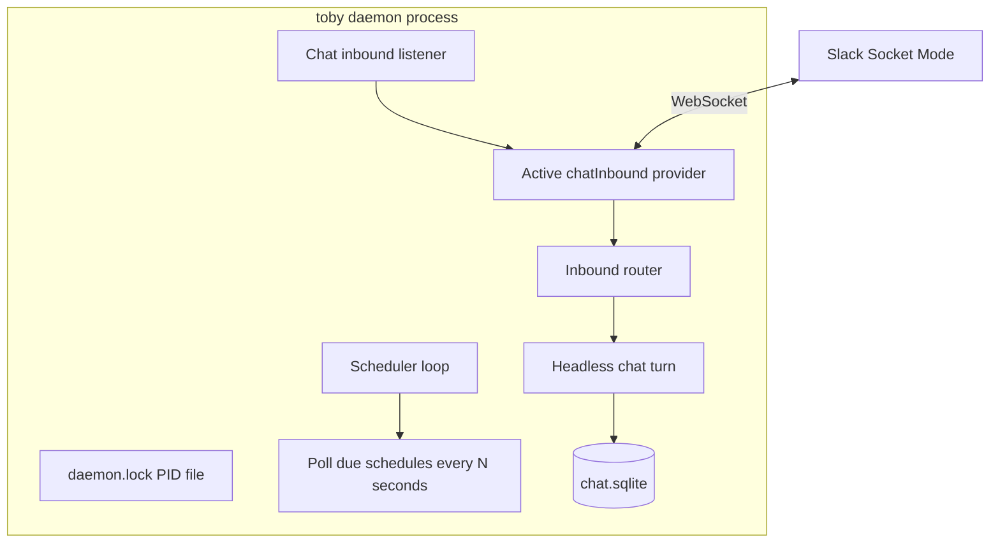
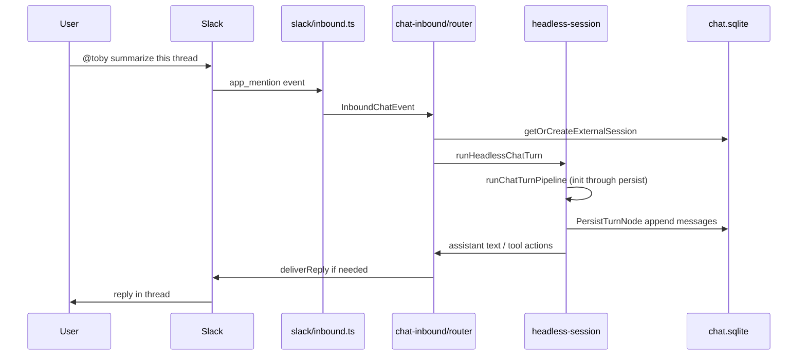

# Daemon

## Overview

The **daemon** is a single long-running Toby process that runs work in the background without the Ink chat UI. Only one instance may run at a time; it records lock metadata in **`~/.toby/daemon.lock`** (PID and poll interval) so `toby daemon start` can detect duplicates and `toby daemon stop` knows which process to signal.

Today the daemon has two responsibilities that run **in parallel** inside that process:

1. **Schedules** — cron-based prompts (summaries, inbox triage, etc.).
2. **Chat inbound** — listen on an external chat provider (Slack via Socket Mode today) and run chat turns when users @mention the bot.

Start it with `toby daemon start` (detached background) or `toby daemon run` (foreground, useful for debugging). Structured activity is appended to **`~/.toby/daemon.log`** (JSON lines, same buffering and rotation model as [`toby.log`](architecture.md#local-data)).

## Process model



| File | Role |
| ---- | ---- |
| `~/.toby/daemon.lock` | Holds daemon lock metadata (PID + interval); prevents duplicate instances |
| `~/.toby/daemon.log` | Structured log for schedules, inbound, Slack connection |
| `~/.toby/chat.sqlite` | Schedules, schedule runs, chat sessions, external session mapping |

Implementation entrypoints:

- CLI: [`src/commands/daemon.ts`](../src/commands/daemon.ts)
- Scheduler: [`src/schedules/scheduler.ts`](../src/schedules/scheduler.ts)
- Inbound: [`src/chat-inbound/`](../src/chat-inbound/)
- Log: [`src/logging/daemon-log.ts`](../src/logging/daemon-log.ts)

## Commands

| Command | Description |
| ------- | ----------- |
| `toby daemon start` | Spawn a detached background daemon (default schedule poll: 60s) |
| `toby daemon run` | Foreground daemon (used internally by `start`) |
| `toby daemon stop` | Stop the process recorded in `daemon.lock` |
| `toby daemon status` | Show PID, inbound connection state, log path |

From chat you can also use **`/start-daemon`** and **`/stop-daemon`** (see [slash-commands.md](slash-commands.md)).

`start` accepts `-i, --interval <seconds>` to change the schedule poll interval.

## Schedules

Schedules are stored in `chat.sqlite` and managed via `toby schedules` or **`/schedules`** in chat. Each schedule has a name, prompt, persona, cron expression, and enabled flag.

When the daemon is running, every poll interval it:

1. Loads schedules that may be due.
2. Evaluates cron against `lastRunAt`.
3. Runs matching schedules through the same tool-calling pipeline as headless chat (non-interactive; no `askUser`).

Schedule execution is logged under category `scheduler` in `daemon.log` (`schedule_run_start`, `schedule_run_complete`, `schedules_fired`, etc.).

User-facing setup: [help-site schedules doc](../help-site/docs/schedules.md).

## Chat inbound

Chat inbound lets Toby **listen** on a connected chat integration and respond in-thread as if the user had typed into `toby chat`.

### How it fits in the daemon

On startup the daemon calls `startChatInboundListeners()` alongside the scheduler loop. If inbound is not configured, the listener exits immediately and only schedules run.

When enabled, the daemon:

1. Reads `config.chatInbound` (integration name, persona, enabled flag).
2. Checks `integrations.<name>.inboundEnabled` and that the integration is connected.
3. Starts that module’s `chatInbound` provider (long-lived connection).
4. Routes normalized events through the shared inbound router.

Only **one** inbound integration is active at a time (e.g. `slack` today; Discord later via the same contract).

### End-to-end flow (@mention in Slack)



**Triggers (Slack):**

- **`app_mention`** — starts a new turn; bot mention is stripped from the prompt text.
- **Direct message (`message.im`)** — any message in a 1:1 DM with the Toby app starts or continues a session (no `@` required).
- **Thread message** (channels only) — after an @mention started a Toby session for that thread, further replies in the thread are handled without another @mention.

Top-level channel messages without an @mention are still ignored.

### Session model

Each **external conversation** (Slack: workspace + channel + thread root) maps to one Toby chat session:

| Concept | Storage |
| ------- | ------- |
| External key | Provider-defined string, e.g. `slack:{teamId}:{channelId}:{threadRootTs}` |
| Toby session | `chat_sessions` row linked via `chat_external_sessions` |
| Message history | Same `chat_session_messages` as the Ink TUI |
| Pending askUser | `awaiting_ask_user_json` on the external session row |

Follow-up @mentions in the **same thread** append to the same session and continue the `CoreMessage[]` history.

### Configuration

In `~/.toby/config.json`:

```json
{
  "chatInbound": {
    "enabled": true,
    "integration": "slack",
    "persona": "Toby"
  },
  "integrations": {
    "slack": {
      "connectedAt": "2026-01-01T00:00:00.000Z",
      "inboundEnabled": true
    }
  }
}
```

Environment overrides:

| Variable | Purpose |
| -------- | ------- |
| `TOBY_CHAT_INBOUND_ENABLED` | `1` / `0` |
| `TOBY_CHAT_INBOUND_INTEGRATION` | e.g. `slack` |
| `TOBY_CHAT_INBOUND_PERSONA` | Persona name |

### Slack setup (reference provider)

Inbound uses **Socket Mode** with a **bot token** (`xoxb-...`) and **app token** (`xapp-...`). The user token from `toby connect slack` (OAuth) is for `toby chat` only and does not power inbound.

1. Slack app: **Socket Mode** on; bot scopes including `app_mentions:read`, `chat:write`, and channel/history scopes; events `app_mention` + `message`.
2. `toby configure`: **Bot Token**, **App Token**, optional **Bot User ID** (visible when daemon inbound targets Slack, even if Auth Method is OAuth).
3. Enable `chatInbound` / `integrations.slack.inboundEnabled`, `toby connect slack` if using OAuth for chat, then `toby daemon start`.

**Which credential when:** see the tables in [help-site Slack integration](../help-site/docs/integrations/slack.md#credentials-and-auth-reference) and [inbound section](../help-site/docs/integrations/slack.md#inbound-mentions-daemon).

### askUser in inbound threads

When the model calls **askUser**, the daemon:

1. Posts the question and numbered options into the Slack thread.
2. Persists pending state on the external session.
3. Waits for the user’s next message in that thread.
4. Maps the reply (number, option label, or free text) and resumes the same tool-calling turn.

This mirrors TUI behavior, but the “terminal” is the chat thread.

### Provider contract (for new integrations)

Integrations implement `ChatInboundProvider` on `IntegrationModule` (`chatInbound` field). The daemon never imports provider SDKs directly—all transport code lives under `src/integrations/<name>/inbound.ts`.

Deep dive on types and extending: [chat-inbound.md](chat-inbound.md).

## Daemon log

All daemon subsystems log to **`~/.toby/daemon.log`** via `daemonLog()` in [`src/logging/daemon-log.ts`](../src/logging/daemon-log.ts):

- Buffered append (flush every ~2s or 50 entries)
- JSON one object per line: `{ ts, level, category, type, data }`
- Rotation when file exceeds `TOBY_DAEMON_LOG_MAX_KB` (default 512; falls back to `TOBY_LOG_MAX_KB`)

**Categories:** `daemon`, `scheduler`, `inbound`, `turn`, `general`.

### Tail the log

```bash
tail -f ~/.toby/daemon.log
```

**Useful events when debugging Slack:**

| type | Meaning |
| ---- | ------- |
| `daemon_started` | Daemon up; includes `logPath`, inbound config |
| `inbound_connecting` | Starting provider listener |
| `inbound_connected` | Provider accepted; for Slack, Socket Mode handshake done next |
| `slack_socket_starting` | Bolt app initializing |
| `slack_socket_connected` | WebSocket active; ready for `app_mention` |
| `slack_app_mention` | Mention received and routed |
| `turn_start` / `turn_complete` | Headless chat turn |
| `ask_user_posted` / `ask_user_resolved` | Interactive choice in thread |
| `inbound_stopped` | Daemon shutting down |

Compact one-line format (for scripts): `formatDaemonLogEntry()` in the same module as chat log’s `formatLogEntry`.

## Troubleshooting

| Symptom | Things to check |
| ------- | ---------------- |
| Schedules never run | `toby daemon status`; log for `schedules_fired`; cron and `enabled` on schedule |
| No inbound activity | `chatInbound.enabled`, `integrations.slack.inboundEnabled`, Slack connected |
| Log shows `inbound_not_connected` | Run `toby connect slack` |
| No `slack_socket_connected` | Bot + app tokens in configure (not user OAuth alone); Socket Mode enabled; see [Slack credential reference](../help-site/docs/integrations/slack.md#credentials-and-auth-reference) |
| Fatal: needs bot token (`xoxb`) | Paste **Bot Token** in configure; OAuth connect does not set it |
| Mentions ignored | Bot invited to channel; `app_mentions:read` scope; check `slack_app_mention` in log |
| Duplicate replies | Router dedupes by `messageId`; check log for `inbound_duplicate` |

## Related docs

- [chat-inbound.md](chat-inbound.md) — provider contract, layers, Discord checklist
- [chat-pipeline.md](chat-pipeline.md) — node pipeline, pretreatment, tools, caching (shared with TUI chat)
- [integrations.md](integrations.md) — `chatInbound` on `IntegrationModule`
- [create-integration.md](create-integration.md#inbound-chat) — adding a new inbound provider
