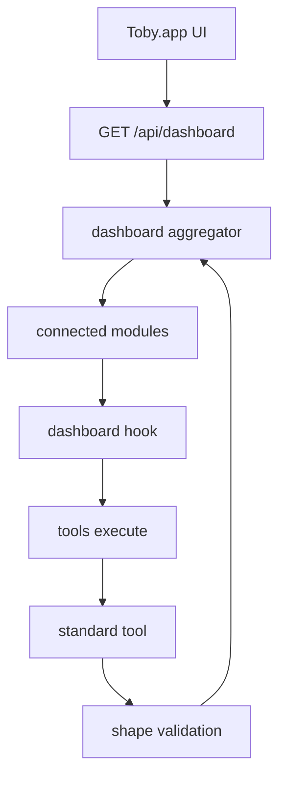

# Dashboard standard data tools — implementation reference

Status: **implemented** (v1). This document is the independent source of truth
for the dashboard data contract, API surface, and plugin implementation
checklist. The native SwiftUI UI can be built from this document alone without
reading the core TypeScript implementation.

For the home UI architecture (**definition-owned static header + single flow
content path**), see [`dashboard.md`](dashboard.md). Named flow pipelines that
produce card bodies are documented in [`flows.md`](flows.md).

Home cards no longer render aggregator list/count chrome. Standard tools remain
the **inside-the-flow** data contract for Tool Executor nodes.

## Problem

The home-screen dashboard (unread mail card, tasks card, onboarding
checklist) needs to pull "what needs your attention" data from whichever
email and task plugins the user has connected — deterministically, on a
timer, without going through the AI chat pipeline.

Every plugin invents its own tool names and result shapes for the same
underlying concept. The standard tools contract adds a reserved, versioned
data contract per provider category so any non-AI consumer can call it and
get a predictable shape back.

## Decisions (v1)

- **Per-source rows**: multiple providers in the same category are preserved
  as per-source rows in the API response, with a category-level total for
  simple cards.
- **Cache TTL**: 60 seconds for **soft** dashboard loads. Manual UI refresh
  sends `?fresh=1` and bypasses that cache (see [`dashboard.md`](dashboard.md)).
- **`groups`**: included in v1 as an optional field. Providers may return no
  groups until they have deterministic buckets (folders, labels, lists).
- **No AI in the deterministic path**: all urgency/grouping on the standard
  tool / aggregator is deterministic (overdue, flagged, starred, list
  membership). Card **bodies** use a single content path that runs a named
  flow (Tool Executor + LLM Prompter) — see [`flows.md`](flows.md) and
  [`dashboard.md`](dashboard.md).

## Standard tool IDs

Each provider category maps to a reserved standard tool ID:

| Provider category | Standard tool ID |
| --- | --- |
| `email` | `email.unreadSummary` |
| `tasks` | `tasks.openSummary` |
| `calendar` | `calendar.upcomingSummary` |
| `work_tracker` (future) | `work_tracker.openSummary` |

A plugin tags one of its tool definitions with `standardTool: "<id>"` to
indicate it fulfills that contract. The tool's `name` can be anything — the
dashboard dispatch finds it by the tag, not by name.

### Reserved input

```json
{ "limit": 20 }
```

`limit` is optional. Default is 20. The dashboard aggregator caps items at
100 per category after merging all sources.

### Reserved output (plugin tool `result`)

```ts
interface DashboardSummaryResult {
  count: number;
  groups?: { id: string; label: string; count: number }[];
  items: DashboardItem[];
  generatedAt: string; // ISO 8601
}

interface DashboardItem {
  id: string;           // opaque, stable — round-trips back to the plugin
  title: string;        // subject / task content
  subtitle?: string;    // sender / project / list name
  detail?: string;      // snippet / description
  timestamp?: string;   // ISO 8601 — received date / due date
  urgency?: "low" | "normal" | "high";
  url?: string;         // deep link
  groupId?: string;     // ties back to groups[].id
}
```

**`urgency` rules**: deterministic only. `\Flagged` IMAP flag = high.
Todoist priority 4 = high. Overdue due date = high. Calendar: in progress or
starting within 1 hour = high; within 24 hours = normal; otherwise low.
Never AI-inferred.

**`groups` rules**: deterministic buckets the source already has (Gmail
labels, IMAP folders, Todoist projects, Reminders lists, calendar names). If
the source has no such signal, omit `groups` entirely.

**Calendar window**: `calendar.upcomingSummary` returns events from **now**
through **now + 7 days**.

## API surface

### `GET /api/dashboard`

Returns aggregated dashboard data from all connected providers.

```ts
interface DashboardData {
  email: DashboardCategorySummary | null;
  tasks: DashboardCategorySummary | null;
  calendar: DashboardCategorySummary | null;
}
```

`null` means no connected providers implement the standard tool for that
category.

**Default provider (calendar):** when `defaultProviders.calendar` is set in
config, the aggregator only queries that integration for the calendar card.
If unset (or the named provider has no dashboard hook), it falls back to all
connected calendar providers with `calendar.upcomingSummary`.

**Sort order:** email and tasks merge items by timestamp **descending**
(newest first). Calendar merges items **ascending** (soonest first).

#### `DashboardCategorySummary`

```ts
interface DashboardCategorySummary {
  count: number;           // sum of all source counts
  sources: DashboardProviderSummary[];  // per-source rows
  items: DashboardItem[];  // merged, timestamp-sorted, capped at 100
  groups: DashboardGroup[]; // union, namespaced by provider
  generatedAt: string;     // ISO 8601 — most recent source timestamp
}

interface DashboardProviderSummary {
  providerName: string;         // integration module name (e.g. "email")
  providerDisplayName: string;  // human-readable (e.g. "Email (IMAP/SMTP)")
  iconUrl?: string;             // optional icon served by local HTTP API
  summary: DashboardSummaryResult;
}
```

#### Merge behavior

- **count**: sum of all source `count` values.
- **sources**: individual provider summaries, one per connected provider
  that responded successfully. Use these for per-account UI rows.
- **items**: all items from all sources concatenated, sorted by `timestamp`
  (descending for email/tasks, ascending for calendar), capped at 100.
- **groups**: union of all source groups. IDs are namespaced as
  `<providerName>:<groupId>` to avoid collisions between providers.
- **generatedAt**: the most recent `generatedAt` across all sources.

#### Failure semantics

- A provider that times out (25s per provider), throws, or returns a
  malformed payload is silently excluded from `sources`. The daemon logs a
  warning. Other providers in the same category are unaffected.
- A category with no connected providers, or where no provider implements
  the standard tool, returns `null`.

#### Caching

The aggregator caches results for 60 seconds on soft loads. Appear / ready
paths within that window receive cached data without re-polling IMAP/APIs.
Manual refresh from Toby.app passes `?fresh=1` (`force: true`) so the
aggregator re-queries providers. Soft cache entries are still write-through
after a force fetch.

#### Example response

```json
{
  "email": {
    "count": 95,
    "sources": [
      {
        "providerName": "email",
        "providerDisplayName": "Email (IMAP/SMTP)",
        "iconUrl": "/api/plugins/email/icon",
        "summary": {
          "count": 95,
          "items": [
            {
              "id": "12345:INBOX",
              "title": "Q3 budget review",
              "subtitle": "cfo@example.com",
              "detail": "Please review the attached...",
              "timestamp": "2026-07-05T10:30:00Z",
              "urgency": "high"
            }
          ],
          "generatedAt": "2026-07-05T11:00:00Z"
        }
      }
    ],
    "items": [
      {
        "id": "12345:INBOX",
        "title": "Q3 budget review",
        "subtitle": "cfo@example.com",
        "detail": "Please review the attached...",
        "timestamp": "2026-07-05T10:30:00Z",
        "urgency": "high"
      }
    ],
    "groups": [],
    "generatedAt": "2026-07-05T11:00:00Z"
  },
  "tasks": {
    "count": 4,
    "sources": [
      {
        "providerName": "todoist",
        "providerDisplayName": "Todoist",
        "iconUrl": "/api/plugins/todoist/icon",
        "summary": {
          "count": 3,
          "groups": [
            { "id": "67890", "label": "Work", "count": 2 },
            { "id": "11111", "label": "Personal", "count": 1 }
          ],
          "items": [
            {
              "id": "task-abc",
              "title": "Finish dashboard UI",
              "subtitle": "Work",
              "timestamp": "2026-07-06T09:00:00Z",
              "urgency": "high",
              "url": "https://todoist.com/app/task/abc",
              "groupId": "67890"
            }
          ],
          "generatedAt": "2026-07-05T11:00:00Z"
        }
      },
      {
        "providerName": "applereminders",
        "providerDisplayName": "Apple Reminders",
        "iconUrl": "/api/plugins/applereminders/icon",
        "summary": {
          "count": 1,
          "groups": [
            { "id": "Shopping", "label": "Shopping", "count": 1 }
          ],
          "items": [
            {
              "id": "rem-xyz",
              "title": "Buy milk",
              "subtitle": "Shopping",
              "timestamp": "2026-07-05T18:00:00Z",
              "urgency": "normal",
              "groupId": "Shopping"
            }
          ],
          "generatedAt": "2026-07-05T11:00:00Z"
        }
      }
    ],
    "items": [
      {
        "id": "task-abc",
        "title": "Finish dashboard UI",
        "subtitle": "Work",
        "timestamp": "2026-07-06T09:00:00Z",
        "urgency": "high",
        "url": "https://todoist.com/app/task/abc",
        "groupId": "67890"
      },
      {
        "id": "rem-xyz",
        "title": "Buy milk",
        "subtitle": "Shopping",
        "timestamp": "2026-07-05T18:00:00Z",
        "urgency": "normal",
        "groupId": "Shopping"
      }
    ],
    "groups": [
      { "id": "todoist:67890", "label": "Work", "count": 2 },
      { "id": "todoist:11111", "label": "Personal", "count": 1 },
      { "id": "applereminders:Shopping", "label": "Shopping", "count": 1 }
    ],
    "generatedAt": "2026-07-05T11:00:00Z"
  }
}
```

## SwiftUI consumption guide

Home cards are **registered blocks** (`DashboardBlockRegistry` /
`CategoryDashboardBlock`). Architecture details: [`dashboard.md`](dashboard.md).

- **Card definition** — static header (title + actions) from
  `DashboardBlockDescriptor`. Never rewritten on refresh.
- **Block content** — `GET /api/dashboard/:category/content` (or `/summary`
  alias). Soft load when home appears and the daemon is ready; `?fresh=1` on
  toolbar / per-card refresh. Body is flow markdown; meta (`count`,
  `launchUrls`, `sources`) supports empty UX and open actions.
- **Local app shortcuts** (sessions, schedules, recordings, memories, skills,
  projects, integrations) still use shared root-scoped stores, refreshed with
  the dashboard toolbar action.

Keep detail payloads lazy. Recording transcripts, memory detail/explanations,
skill bodies, project file trees, and schedule run transcripts should load only
when the user opens the corresponding detail surface.

### Card rendering

1. **Title**: definition only (`descriptor.title`).
2. **Actions**: definition + optional content meta for enablement / open URLs.
3. **Body**: `content.text` markdown when non-empty.
4. **Empty**: definition `emptyWhenNil` (JSON null / no providers) or
   `emptyWhenZero` (count 0 / empty text).
5. Do **not** show header count badges or aggregator item lists on home cards.

### Null handling

If content is `null`, show the definition’s “not connected” empty state.

## Plugin implementation checklist

To add dashboard support to a new or existing plugin:

1. **Add a standard tool** to your plugin's `TOOL_DEFINITIONS`:
   ```ts
   {
     name: "getUnreadSummary",  // any name
     displayName: "Unread summary",
     description: "...",
     readOnly: true,
     standardTool: "email.unreadSummary",  // the reserved ID
     inputSchema: {
       type: "object",
       properties: {
         limit: { type: "number", description: "Max items (default 20)" }
       }
     }
   }
   ```

2. **Implement the tool execution** in your plugin's `executeTool` switch.
   Return a `DashboardSummaryResult`:
   ```ts
   case "getUnreadSummary": {
     const limit = Number(input.limit ?? 20) || 20;
     // fetch data from your source
     return {
       result: {
         count: /* total unread */,
         items: /* mapped to DashboardItem[] */,
         groups: /* optional, deterministic only */,
         generatedAt: new Date().toISOString(),
       }
     };
   }
   ```

3. **Map your data to `DashboardItem`**:
   - `id`: stable, opaque identifier
   - `title`: subject / task content
   - `subtitle`: sender / project / list name
   - `detail`: snippet / description (truncated)
   - `timestamp`: ISO 8601 received/due date
   - `urgency`: "high" only for deterministic signals (flagged, overdue,
     priority 4). Never AI-inferred.
   - `url`: deep link if available
   - `groupId`: ties to a group `id` if you return `groups`

4. **No protocol version bump needed**: the `standardTool` field is a
   backward-compatible addition to `PluginToolDefinition`. Existing plugins
   without it simply don't contribute to dashboard cards.

## Enforcement

### Soft (v1)

- **`toby plugins doctor`**: emits a warning if a plugin declares
  `providerCategories: ["email"]` but no tool carries
  `standardTool: "email.unreadSummary"`. Same for `tasks`.
- **Runtime shape validation**: plugin results are validated against a zod
  schema. Malformed payloads are logged and treated as "no data" for that
  card.

### Hard (future)

- After all first-party plugins comply, the doctor warning can be promoted
  to a hard install-time failure for new plugins declaring those categories.

## First-party plugin implementations

### plugin-email (`email.unreadSummary`)

- Tool: `getUnreadSummary` (read-only, tagged `email.unreadSummary`)
- Queries unread INBOX messages from the local SQLite cache
- `urgency: "high"` for messages with `\Flagged` IMAP flag
- No `groups` in v1 (IMAP flags don't map to meaningful buckets)
- Items: `id` = `uid:mailbox`, `title` = subject, `subtitle` = from address,
  `detail` = snippet, `timestamp` = date

### plugin-todoist (`tasks.openSummary`)

- Tool: `getOpenTasksSummary` (read-only, tagged `tasks.openSummary`)
- Fetches open tasks via Todoist API, maps to dashboard items
- `groups`: one per Todoist project (id = project ID, label = project name)
- `urgency: "high"` for priority 4 tasks or overdue tasks
- Items: `id` = task ID, `title` = content, `subtitle` = project name,
  `detail` = description, `timestamp` = due date, `url` = task URL,
  `groupId` = project ID

### plugin-applereminders (`tasks.openSummary`)

- Tool: `getOpenRemindersSummary` (read-only, tagged `tasks.openSummary`)
- Queries incomplete reminders via Toby.app native API
- `groups`: one per reminder list (id = list name, label = list name)
- `urgency: "high"` for priority 1 (EventKit high) or overdue reminders
- Items: `id` = reminder ID, `title` = title, `subtitle` = list name,
  `detail` = notes, `timestamp` = due date, `url` = reminder URL,
  `groupId` = list name

## Architecture



### Key files

| File | Purpose |
| --- | --- |
| `packages/core/src/dashboard/types.ts` | Contract types: `StandardToolId`, `DashboardSummaryResult`, `DashboardItem`, `DashboardCategorySummary`, `DashboardData` |
| `packages/core/src/dashboard/schema.ts` | Zod validation for plugin results |
| `packages/core/src/dashboard/index.ts` | Aggregator: `getDashboardData()`, caching, per-provider timeout |
| `packages/core/src/dashboard/summarizer.ts` | AI summaries: cache + invoke category flows |
| `packages/core/src/dashboard/prompts.ts` | Category prompts, persona, item formatting for LLM |
| `packages/core/src/flows/` | Named flow runtime (Tool Executor + LLM Prompter); see [`flows.md`](flows.md) |
| `packages/core/src/integrations/types.ts` | `IntegrationModule.dashboard` hook |
| `packages/core/src/integrations/plugins/protocol.ts` | `PluginToolDefinition.standardTool` field |
| `packages/core/src/integrations/plugins/adapter.ts` | `buildPluginDashboardHook()` — synthesizes dashboard hook for installable plugins |
| `packages/core/src/integrations/plugins/validate.ts` | `checkStandardToolCompliance()` — doctor warning |
| `packages/core/src/web/handlers/dashboard.ts` | Dashboard HTTP handlers (data + AI summary) |
| `packages/core/src/web/routes.ts` | `GET /api/dashboard`, `/:category`, `/:category/content` (+ `/summary` alias) |

## Future extensions

- `work_tracker.openSummary` for work trackers (Jira, Linear)
- Multi-provider inputs into dashboard AI flows (today: one default/connected provider per flow Tool Executor)
- Promoting the doctor warning to a hard install-time failure
