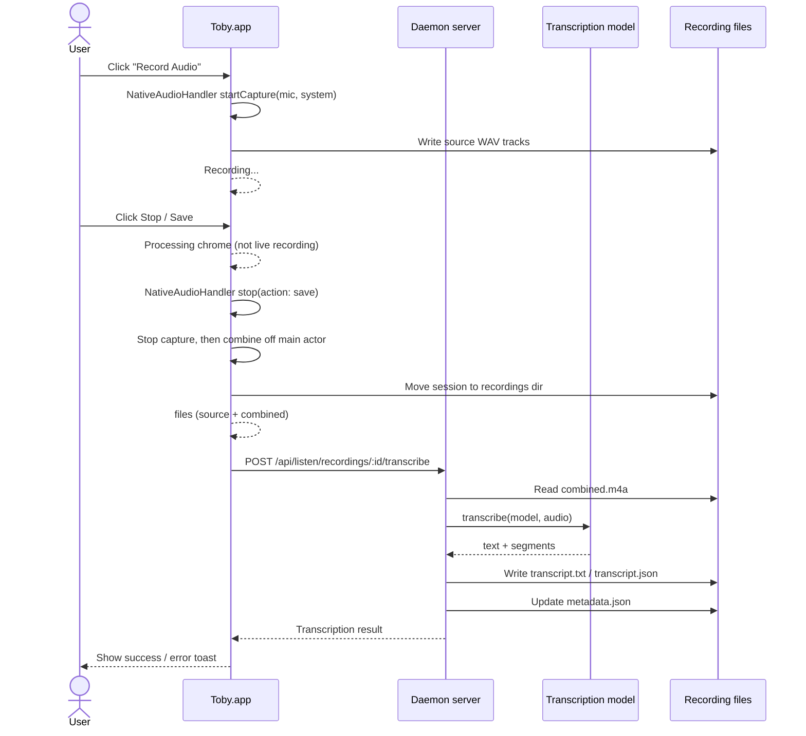

# Listen mode

`toby listen` opens the native Toby app recording controls. Listen is not a
separate integration capability: the shared recording lifecycle, metadata,
lookup, and transcription adapters live in `packages/core/src/listen/`.
Toby.app provides native recording controls and the Recordings window.

## Current Scope

- macOS-only capture adapter.
- Record microphone, system audio, or both from Toby.app (defaults: both;
  configurable under **Settings → Transcription**).
- Save source tracks separately as PCM `wav` files (`mic.wav`, `system.wav`).
- Generate `combined.m4a` after listening stops for playback/transcription.
  When **both** sources are present, combined is **dual-mono stereo**
  (left = microphone, right = system audio)—not a sample-level sum. Summing
  reintroduces headphone bleed as an audible echo. Raw source WAVs are always
  kept; the Recordings player defaults to **System** for a clean mono preview.
- Generate `transcript.txt` and `transcript.json` via the configured
  transcription model. When the model returns timed segments (common with
  Whisper-class models), `transcript.json` stores start time and duration per
  segment; the Recordings window shows those timestamps and Copy uses the timed
  text. Plain `transcript.txt` remains a single concatenated string.
- Optionally generate `summary.md` via the configured summary persona after
  transcription (on demand from the Recordings window).
- Write `metadata.json` next to each recording (includes optional `combine`
  diagnostics: mode / channel layout).

Recordings are stored under `~/.toby/listen/recordings/<recording-id>/`.

## Commands

```bash
toby listen
toby listen transcribe ~/.toby/listen/recordings/<recording-id>
```

`toby listen transcribe <recording-folder>` retries transcription for an
existing saved recording. The command uses `metadata.files.combined` when it
points to an existing file, otherwise it falls back to
`<recording-folder>/combined.m4a`.

## Toby.app Flow

Toby.app exposes **Record Audio** in the chat sidebar. Starting it calls the
app's own native localhost API and captures the sources selected in config
(`listen.recordMic` / `listen.recordSystem`, both default **on**) in the
Toby.app process. This keeps Microphone and Screen/System Audio permission tied
to the app's stable bundle identity.

In the **Recordings** inspector, playback can switch between **System**,
**Mic**, and **Both (L/R)** (dual-mono combined) when those files exist.

Stopping performs these steps:

1. Toby.app immediately leaves live-capture chrome (red pulse / Stop control)
   and shows a **processing** state (toast, toolbar, sidebar, menu bar, Dock).
   Extra Stop / Record clicks are ignored until processing finishes so they
   cannot start a second take.
2. `NativeAudioHandler` stops capture, then validates source files and exports
   `combined.m4a` (dual-mono stereo when both tracks exist) **off the main
   actor**. Native `GET /api/native/audio/status` reports `stopping` until
   the session is moved into the shared recordings directory.
3. The app calls the daemon's
   `POST /api/listen/recordings/:id/transcribe` endpoint.
4. The daemon invokes the configured transcription plugin and updates
   `metadata.json` with transcript paths, or appends the failure to
   `metadata.errors`. A later successful re-transcribe clears those errors
   (and any prior AI summary).
5. Toby.app shows a success/error toast and the result becomes available in
   the **Recordings** window.

The Recordings window fetches list and detail data from the daemon. Reselecting
**Recordings** in the workspace dropdown clears the current selection and shows
a card overview of saved recordings. While a
recording is in progress, the detail pane shows live capture metadata and a
**Stop Recording** control that uses the same stop path as the toolbar and
menu bar. After stop, while combine / transcription is still running, the
window shows a processing card instead of the live “Recording in progress”
pane. After processing, the window supports audio playback, transcript viewing,
AI summarization, metadata editing, and confirmed deletion. Selecting a saved
recording paints the header and inspector immediately from the list row;
transcript, summary, and the audio player show skeletons until the detail
payload is decoded (off the main actor) so a long recording does not freeze
the UI. Deletion is sent to `DELETE /api/listen/recordings/:id`; the SwiftUI
app does not remove recording directories directly.

### Recording summaries

When a recording has a non-empty transcript, the inspector shows a
**Summarize** button (or **Re-Summarize** when a summary already exists). The
app calls `POST /api/listen/recordings/:id/summarize`. The daemon:

1. Reads `transcript.txt` for the recording.
2. Resolves the persona from `config.listen.summaryPersona` (Settings →
   Transcription → **Persona for recording summaries**), falling back to the
   default persona.
3. Runs a one-shot `generateText` call (no chat tools).
4. Writes `summary.md` and updates `metadata.json` (`files.summary`,
   `summary.createdAt`, `summary.personaName`).

Re-summarize replaces the existing `summary.md`. Re-transcribe clears any
persisted summary so it cannot outlive a new transcript.



## Native Boundary

Node/Bun does not provide direct access to macOS audio capture APIs, so
recording runs through **Toby.app**.

Toby.app runs a local HTTP server on an ephemeral port published to
`~/.toby/native-port`. The core audio capture client reads that port, launches
Toby.app if it is not already running, and calls the `/api/native/audio/*`
endpoints. Audio capture, permission handling, and source-track combination all
happen inside Toby.app's `NativeAudioHandler`.

## Capture sources and combine layout

| Setting key | Default | Meaning |
| ----------- | ------- | ------- |
| `listen.recordMic` | `true` | Capture the default microphone (**input** — your voice) |
| `listen.recordSystem` | `true` | Capture system/app audio via ScreenCaptureKit (**output** — what you hear) |

Turn either off under **Settings → Transcription** if you only need one source.
At least one source must remain on.

These are not “two mics.” Combined is meant to keep **input and output**
together for transcription/archival. When both are present:

| File | Content |
| ---- | ------- |
| `mic.wav` | Microphone only |
| `system.wav` | System audio only |
| `combined.m4a` | Stereo dual-mono: **L = mic**, **R = system** (no sum) |

**Why not sum?** The mic often re-picks up remote meeting audio that is already
on the system track (headphone bleed). Sample-summing those tracks creates a
delayed echo. Dual-mono avoids that for listening; the player defaults to
**System** for a clean mono preview of the meeting.

## Transcription providers

The transcription stack (`packages/core/src/listen/transcription-model.ts`)
supports four providers:

| Provider | Key resolution |
| -------- | -------------- |
| `openai` | `credentials.transcription.openai.apiKey` → shared `credentials.ai.openai.token` |
| `groq` | `credentials.transcription.groq.apiKey` |
| `vercel` | `credentials.transcription.vercel.apiKey` → shared `credentials.ai.vercel.apiKey` → `AI_GATEWAY_API_KEY` → `VERCEL_OIDC_TOKEN` (OIDC-only, empty key) |
| `openrouter` | `credentials.transcription.openrouter.apiKey` → shared `credentials.ai.openrouter.apiKey` → `OPENROUTER_API_KEY` |

The Vercel provider uses `createGateway(...).transcriptionModel(slug)` from
`@ai-sdk/gateway` and the stable `transcribe()` function from AI SDK 7. Model
lists for Vercel are fetched from the public gateway catalog
(`https://ai-gateway.vercel.sh/v1/models`), filtered to `type === "transcription"`,
with a curated static fallback.

The OpenRouter provider uses OpenAI-compatible multipart
`/api/v1/audio/transcriptions` (via `createOpenAI` pointed at
`https://openrouter.ai/api/v1`). Model lists are fetched from
`GET https://openrouter.ai/api/v1/models?output_modalities=transcription`, with
a curated static fallback when the catalog is unreachable.

All providers share WAV preparation, 25 MB chunking, and 413-retry logic.

Toby.app runs a local HTTP server on an ephemeral port published to
`~/.toby/native-port`. The core audio capture client reads that port, launches
Toby.app if it is not already running, and calls the `/api/native/audio/*`
endpoints. Audio capture, permission handling, and source-track combination all
happen inside Toby.app's `NativeAudioHandler`.

For local development, build Toby.app from the repo root:

```bash
bun run build:app
```

In development, the core client looks for Toby.app at common locations, with
`TOBY_APP_PATH` taking precedence:

- `~/dev/karim/toby/dist/Toby.app`
- `~/.local/bin/Toby.app`
- `/Applications/Toby.app`
- `~/Applications/Toby.app`

The native audio endpoints are:

- `POST /api/native/audio/start` with body `{ "mic": true, "system": true }`
- `POST /api/native/audio/stop` with body `{ "action": "save" | "discard" }`
- `POST /api/native/audio/combine` with body `{ "outDir": "...", "mic": "...", "system": "..." }`

## macOS APIs

- Microphone input: `AVFoundation`.
- System audio: `ScreenCaptureKit`.
- Combination/export: `AVFoundation` asset export.

Microphone and Screen/System Audio permissions are granted to Toby.app.
