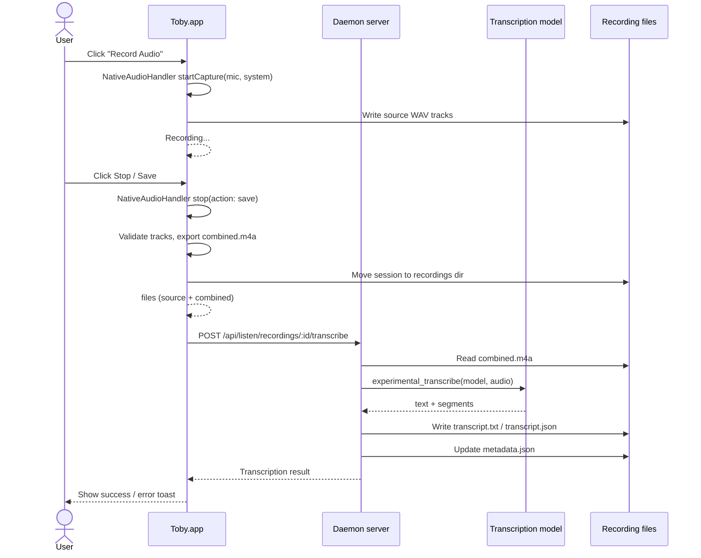

# Listen mode

`toby listen` opens the native Toby app recording controls. Listen is not a
separate integration capability: the shared recording lifecycle, metadata,
lookup, and transcription adapters live in `packages/core/src/listen/`.
Toby.app provides native recording controls and the Recordings window.

## Current Scope

- macOS-only capture adapter.
- Record microphone, system audio, or both from Toby.app.
- Save source tracks separately as PCM `wav` files.
- Generate `combined.m4a` after listening stops for playback/transcription.
- Generate `transcript.txt` and `transcript.json` via the configured
  transcription model.
- Write `metadata.json` next to each recording.

Recordings are stored under `~/.toby/listen/recordings/<recording-id>/`.

## Commands

```bash
toby listen
toby listen transcribe ~/.toby/listen/recordings/<recording-id>
```

`toby listen transcribe <recording-folder>` retries transcription for an
existing saved recording. The command uses `metadata.files.combined` when it
points to an existing file, otherwise it falls back to
`<recording-folder>/combined.m4a`.

## Toby.app Flow

Toby.app exposes **Record Audio** in the chat sidebar. Starting it calls the
app's own native localhost API and captures microphone and system audio in the
Toby.app process. This keeps Microphone and Screen/System Audio permission tied
to the app's stable bundle identity.

Stopping performs these steps:

1. `NativeAudioHandler` stops capture, validates source files, exports
   `combined.m4a`, and moves the temporary session into the shared recordings
   directory.
2. The app calls the daemon's
   `POST /api/listen/recordings/:id/transcribe` endpoint.
3. The daemon invokes the configured transcription plugin and updates
   `metadata.json` with transcript paths or errors.
4. Toby.app shows a success/error toast and the result becomes available in
   the **Recordings** window.

The Recordings window fetches list and detail data from the daemon. It supports
audio playback, transcript viewing, metadata editing, and confirmed deletion.
Deletion is sent to `DELETE /api/listen/recordings/:id`; the SwiftUI app does
not remove recording directories directly.



## Native Boundary

Node/Bun does not provide direct access to macOS audio capture APIs, so
recording runs through **Toby.app**.

Toby.app runs a local HTTP server on an ephemeral port published to
`~/.toby/native-port`. The core audio capture client reads that port, launches
Toby.app if it is not already running, and calls the `/api/native/audio/*`
endpoints. Audio capture, permission handling, and source-track combination all
happen inside Toby.app's `NativeAudioHandler`.

For local development, build Toby.app from the repo root:

```bash
bun run build:app
```

In development, the core client looks for Toby.app at common locations, with
`TOBY_APP_PATH` taking precedence:

- `~/dev/karim/toby/dist/Toby.app`
- `~/.local/bin/Toby.app`
- `/Applications/Toby.app`
- `~/Applications/Toby.app`

The native audio endpoints are:

- `POST /api/native/audio/start` with body `{ "mic": true, "system": true }`
- `POST /api/native/audio/stop` with body `{ "action": "save" | "discard" }`
- `POST /api/native/audio/combine` with body `{ "outDir": "...", "mic": "...", "system": "..." }`

## macOS APIs

- Microphone input: `AVFoundation`.
- System audio: `ScreenCaptureKit`.
- Combination/export: `AVFoundation` asset export.

Microphone and Screen/System Audio permissions are granted to Toby.app.
