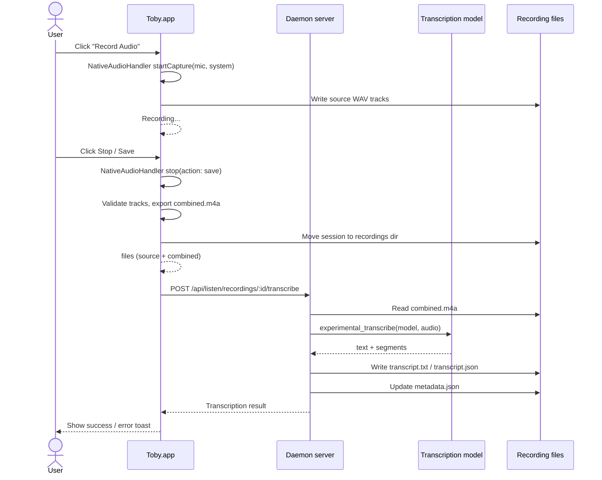
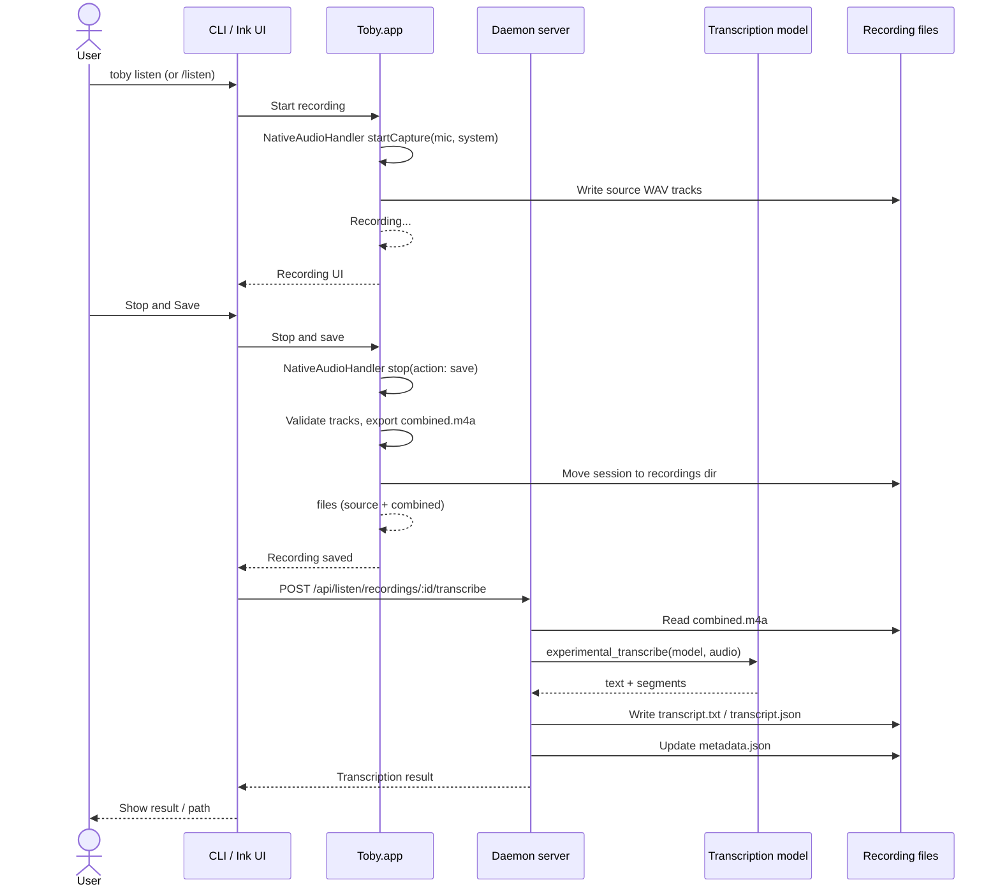

# Listen mode

`toby listen` opens **Configuration** focused on the **Listen** section. It is
not a separate integration capability: the shared recording lifecycle,
metadata, lookup, and transcription adapters live in `packages/core/src/listen/`.
The Ink UI is part of the configure tree, while Toby.app provides a native
recording control and a separate Recordings window.

## Current scope

- macOS-only capture adapter.
- Record microphone, system audio, or both.
- Save source tracks separately as PCM `wav` files.
- Generate `combined.m4a` after listening stops for playback/transcription.
- Generate `transcript.txt` and `transcript.json` via the built-in
  **transcription model** (configured under **Settings → Transcription**)
  when a provider and model are configured.
- Write `metadata.json` next to each recording.

Recordings are stored under `~/.toby/listen/recordings/<recording-id>/` by
default. Pass `--out-dir <path>` to store recording folders elsewhere.

## Command

```bash
toby listen
toby listen --mic-only
toby listen --system-only
toby listen transcribe ~/.toby/listen/recordings/<recording-id>
```

## UI

### CLI / Ink

Listen lives under **Configuration → Listen** (same pattern as Skills):

- **`toby listen`** opens config with Listen expanded and **Start new recording** selected.
- **`toby config`** → expand **Listen** to browse recordings or start a new one.
- **Start new recording** — action row at the top; the right pane shows mic/system source toggles.
- **Saved recordings** — one row per recording under Listen; the right pane shows metadata and actions.

Keyboard shortcuts (with Listen or a recording selected):

- `↑↓` navigate within the focused pane.
- `Tab` switches focus between the category tree and the detail pane (auto-focused on the detail pane while recording).
- `Enter` to select/toggle the focused item.
- `s` to stop and save while listening.
- `d` to stop and discard while listening.
- `Esc` moves focus back to the category tree from the detail pane.
- `q` to close, confirming discard if a recording is active.

The recording interface shows an animated red dot indicator, a bold "Recording" label, an elapsed timer, and two actions: a green bold "Stop and Save" (default) and a red bold "Stop and Discard".

In the recording detail view, `Enter` on Name or Description opens an editor, `Enter` on "Open folder in Finder" opens the folder, and `Enter` on "Delete recording" deletes after confirmation.

Each recording's `metadata.json` can include optional `name` and `description`
fields. The listen UI edits those fields in place.

Use `toby listen transcribe <recording-folder>` to retry transcription for an
existing saved recording. The command uses `metadata.files.combined` when it
points to an existing file, otherwise it falls back to `<recording-folder>/combined.m4a`.

### Toby.app

Toby.app exposes **Record Audio** in the chat sidebar. Starting it calls the
app's own native localhost API and captures microphone and system audio in the
Toby.app process. This keeps Microphone and Screen/System Audio permission tied
to the app's stable bundle identity instead of a development helper binary.

Stopping performs these steps:

1. `NativeAudioHandler` stops capture, validates the source files, exports
   `combined.m4a`, and moves the temporary session into the shared recordings
   directory.
2. The app calls the daemon's
   `POST /api/listen/recordings/:id/transcribe` endpoint.
3. The daemon invokes the configured transcription plugin and updates
   `metadata.json` with transcript paths or errors.
4. Toby.app shows a success/error toast and the result becomes available in
   the **Recordings** window.

The Recordings window fetches list and detail data from the daemon. It supports
audio playback, transcript viewing, and confirmed deletion either from the
sidebar context menu or the red detail-toolbar button. Deletion is sent to
`DELETE /api/listen/recordings/:id`; the SwiftUI app does not remove recording
directories directly.

## Chat slash commands

The chat TUI also exposes lightweight recording controls:

```text
/listen
/stop-listening
```

`/listen` starts recording microphone and system audio for the active chat session. `/stop-listening` stops and saves the recording, runs transcription, writes the same recording folder artifacts as `toby listen`, and injects the transcript as hidden user context so the assistant can summarize or reason about what was said. If transcription is unavailable, the saved audio path is still shown in chat.

These commands use the shared macOS audio capture client and session
controller, then route transcription through the daemon. Recording happens
inside Toby.app, so the same app bundle identity handles microphone and system
audio permissions.

## Recording flow diagrams

The two diagrams below show the same end-to-end recording lifecycle from the
app and CLI perspectives. The actors are:

- **User** — the person starting or stopping a recording.
- **Toby.app** — the native SwiftUI app; owns `NativeAudioHandler`, the
  macOS audio/screen permissions, and the localhost interface used by the CLI.
- **CLI / Ink** — the terminal configure UI or chat slash commands.
- **Daemon** — the background `toby` server that runs transcription for saved
  recordings and serves the recordings API.
- **Transcription model** — an AI-SDK transcription model (OpenAI or Groq)
  configured under **Settings → Transcription**.
- **Files** — the recording directory under `~/.toby/listen/recordings/<id>/`.

### App recording flow



### CLI recording flow



## Helper boundary

Node/Bun does not provide direct access to macOS audio capture APIs, so the
CLI routes recording through the native **Toby.app**.

Toby.app runs a local HTTP server on an ephemeral port published to
`~/.toby/native-port`. The core audio capture client reads that port, launches
Toby.app if it is not already running, and calls the `/api/native/audio/*`
endpoints. Audio capture, permission handling, and source-track combination
all happen inside Toby.app's `NativeAudioHandler`.

For local development, build Toby.app from the repo root:

```bash
bun run build:app
```

In development, the core client looks for Toby.app at common locations (with
`TOBY_APP_PATH` taking precedence):

- `~/dev/karim/toby/dist/Toby.app`
- `~/.local/bin/Toby.app`
- `/Applications/Toby.app`
- `~/Applications/Toby.app`

The native audio endpoints are:

- `POST /api/native/audio/start` with body `{ "mic": true, "system": true }`
- `POST /api/native/audio/stop` with body `{ "action": "save" | "discard" }`
- `POST /api/native/audio/combine` with body `{ "outDir": "...", "mic": "...", "system": "..." }`

## macOS APIs

- Microphone input: use `AVFoundation` (`AVAudioEngine` or
  `AVAudioRecorder`). This requires Microphone permission.
- System output audio: use `ScreenCaptureKit` audio capture. On current macOS
  versions this is tied to Screen Recording or System Audio Recording
  permission, depending on OS version.
- Write separate source tracks first, then export a generated `combined.m4a`
  after recording stops. The source files remain the debugging/source-of-truth
  artifacts if one stream fails or needs reprocessing.

## Transcription

After the native audio handler combines audio into `combined.m4a`, Toby
transcribes it directly in the daemon using the AI SDK's `transcribe` with the
provider and model configured under **Settings → Transcription**.

Supported providers:

- **OpenAI** — `whisper-1`, `gpt-4o-transcribe`, `gpt-4o-mini-transcribe`
  (reuses your **AI → OpenAI** API token when no transcription-specific key
  is set).
- **Groq** — `whisper-large-v3-turbo`, `whisper-large-v3` (requires a Groq
  API key entered in the Transcription section).

The daemon endpoint prefers combined audio, then falls back to microphone or
system WAV files when necessary. Input already stored as WAV is passed directly
to the model; other formats are converted to mono 16 kHz WAV on macOS before
invocation.

The daemon writes transcript artifacts into the recording folder as:

- `transcript.txt` — readable transcript text.
- `transcript.json` — structured payload with text, segment timing, source
  audio path, timestamp, and locale.

### No model configured

If no transcription provider/model is configured, pressing **Record** shows a
toast (with an **Open settings** CTA that jumps to **Settings → Transcription**)
and the recording continues. When the recording is saved, the audio is kept and
a note is recorded in `metadata.json`; no transcript is produced. Retry later
with `toby listen transcribe <recording-folder>` after configuring a model.

If transcription fails, Toby still saves the audio recording and records the
error in metadata. Retry with `toby listen transcribe <recording-folder>`.
